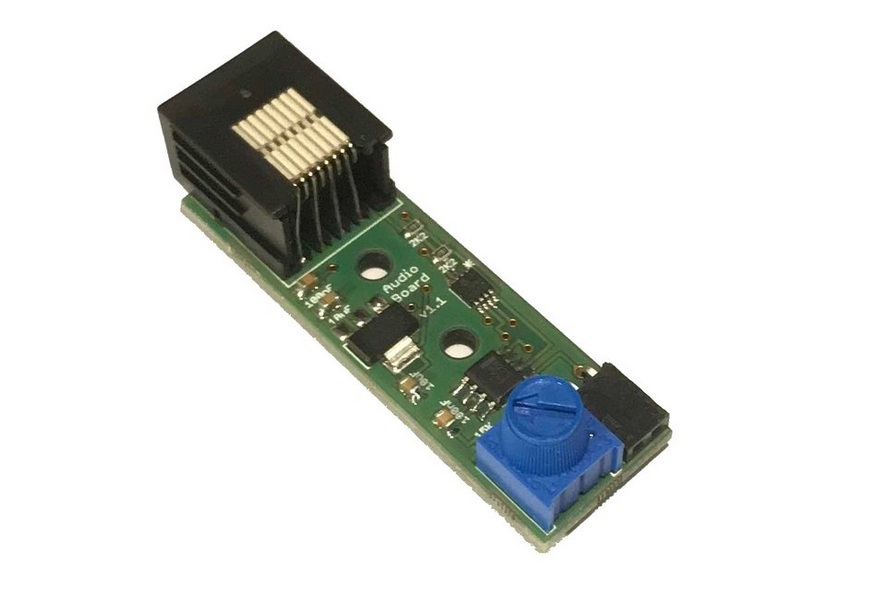

# Audio board

An audio amplifier board for driving a speaker to produce auditory stimuli. The board uses the micropython DAC for stimulus generation. The audio board must be plugged into a port on the breakout board which supports DAC output and I2C serial communication (used to set the volume). Up to two audio boards can be used with a single breakout board allowing two speakers to be driven independently.

[documentation](https://pycontrol.readthedocs.io/en/latest/user-guide/hardware/#audio-board)

