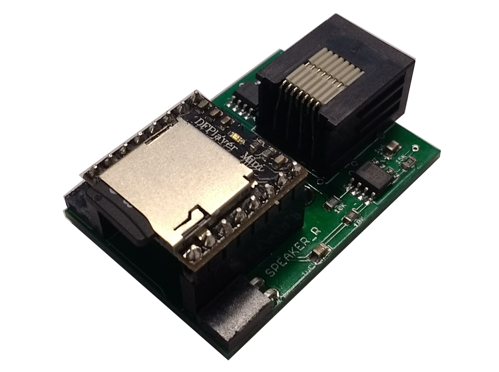

# Audio player

An audio board for pyControl which uses a [DF player](https://www.dfrobot.com/wiki/index.php/DFPlayer_Mini_SKU:DFR0299) module to play wav files from an SD card. The board has two speaker outputs which can be independently enabled/disabled, allowing stereo wav files to be played, or mono wav files to be played from either or both speakers. 

[Documentation](https://pycontrol.readthedocs.io/en/latest/user-guide/hardware/#audio_player)

