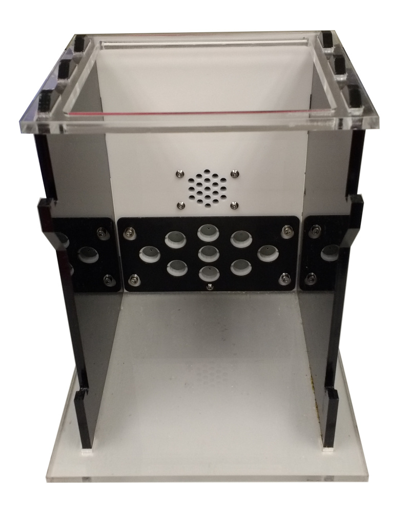
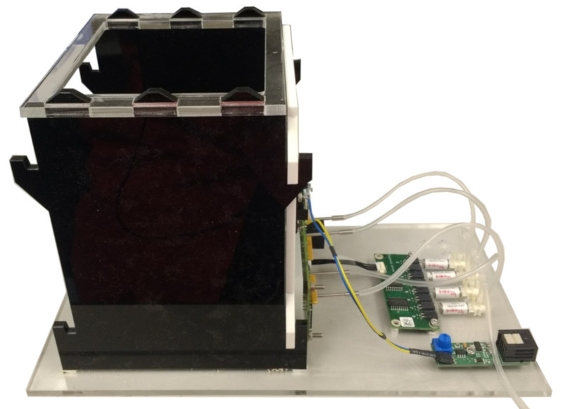

# Small behaviour box

| Front                                                | Side                                                |
| ---------------------------------------------------- | --------------------------------------------------- |
|  |  |

- [ ] A small (12 x 12cm) operant box suitable for mice.  The operant box is assembled from laser cut plastic and slots together without glue or fastenings.  The back or side panels can be modified to mount nose pokes or other behavioural hardware.  Back panel variants with different hardware layouts are included in the folder back_panel_variants; the images above show the nine poke back panel.

- [ ] ## Assembly instructions.

  1. Get the plastic parts laser cut using the design files in the *panels* folder.  The PDF files are editable in Adobe Illustrator.  The DXF files have scale 1 unit = 1mm.
  2. If using panels modified to mount behavioural hardware, mount the hardware onto the panels (see assembly instructions for individual panel variants).
  3. Slot the side panels into the base, mount the back and top panels onto the sides.
  4. Optional: Mount PCBs used in the setup onto the base.  Inert the threaded inserts into the round holes in the base, attach the PCBs using 3mm hex spacers and 8mm M3 screws.  There are mounting holes in the base with spacing suitable to mount the boards *Audio_board*, *Audio_player*, *LED_driver*, *Lickometer*, *Port_adaptor*, *Solenoid_driver*.  The above photos show an Audio board and Solenoid driver mounted to the base.

