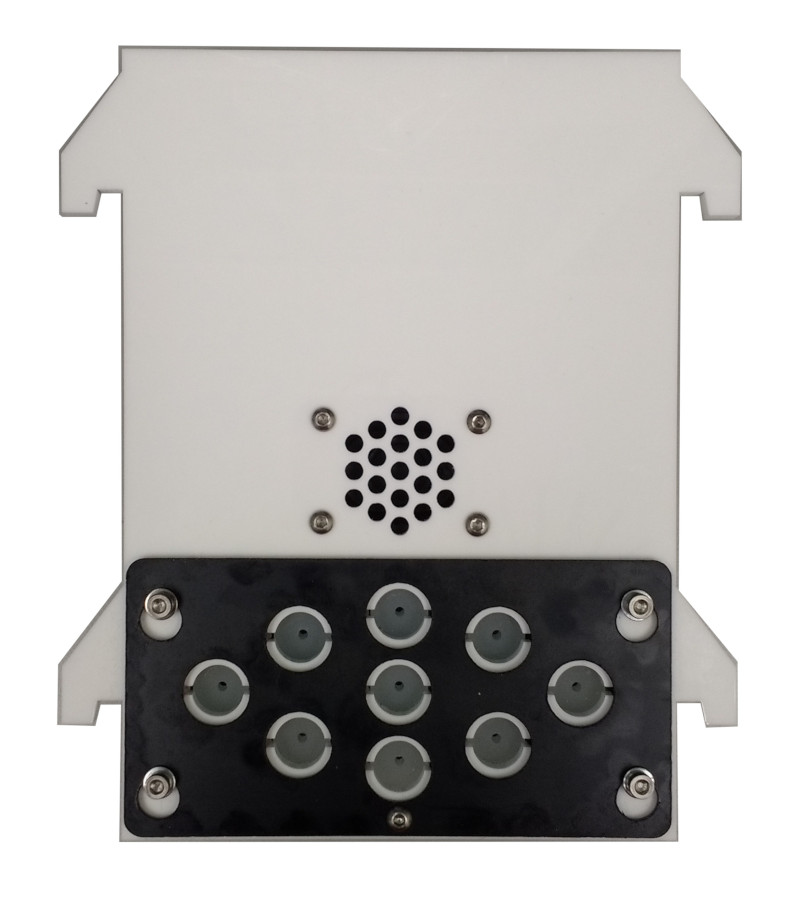
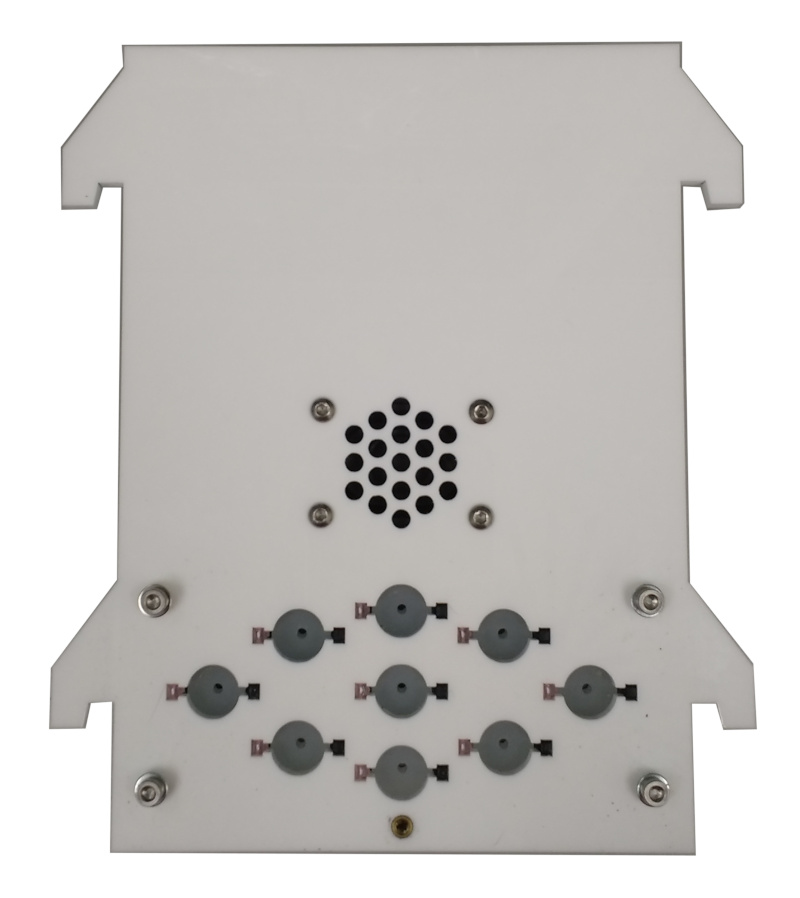
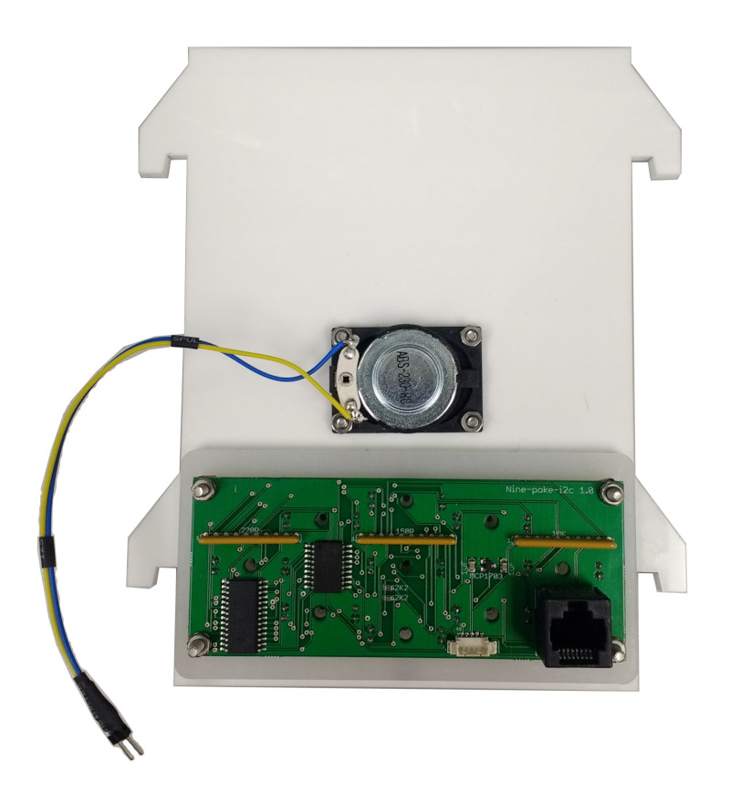
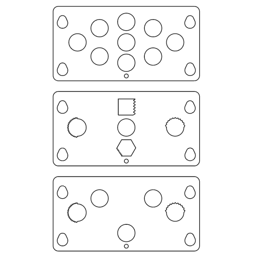

# Nine poke panel

| Front with poke cover mounted                               | Front without poke cover                          |
| ----------------------------------------------------------- | ------------------------------------------------- |
|  |   |
| **Back**                                                    | **Example poke covers**                           |
|              |  |

A panel with 9 nose poke ports, each with IR beam and LED, and a speaker.  Removable covers allow only those ports used for the current task to be exposed.

## Assembly instructions.

1.  Laser cut the plastic parts using the design files in the *panels* folder.  The PDF files are editable in Adobe Illustrator.  The DXF files have scale 1 unit = 1mm.
2. Put an **M3 washer** followed by a **2mm round spacer** onto each of the **25mm M3 cap head screws**, then insert the screws through the **wall_white_5mm_acrylic** panel.  
3. If you are going to deliver liquid rewards in the nose pokes, it is recommended to put a bit of Vaseline on the back of the white wall panel surrounding the pokes.  This prevents fluid from running down between the wall panel and the back of the pokes.
4. Put the **ports_white_5mm** panel onto the back of the wall panel, so that the 25mm screws are going through the holes in both panels. 
5. Take the small circular pieces of opal acrylic cut from panel **ports_opal030_5mm** and slot them onto the holes in the white panel.  These form the back wall of the pokes and allow the light from the stimulus LED to shine through.
6.  Place the panel **ports_black_1.5mm_HIPS** over the back of the ports, oriented such that the 3 long thin slots are on the upper side of the panel and the rectangular opening is in the bottom right as you look from behind the ports.
7. Put the **Nine poke PCB** into position, such that the IR beam components slot into the holes in the acrylic.  This can be quite fiddly so take your time and don't just try and force it in if it is stuck.
8. Put the **M3 nuts** on the 25mm bolts and tighten to hold the poke assembly together.
9. Attach the **speaker** to the back of the wall panel using the **12mm M3 button head screws** and **M3 nuts**.
10. Insert the **M3 threaded insert** into the hole in the center of the wall below the pokes.  Make sure the side of the insert with the threaded hole is on the same side as the pokes. 
11. Mount a **poke cover** on the front of the wall by slotting it over the washers.  To hold the cover in position screw an **M3 button head screw** through the hole in the poke cover into the M3 threaded insert.
