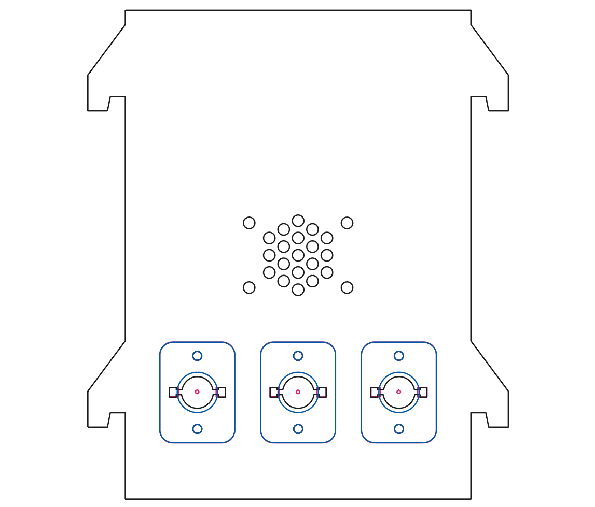

# Three pokes panel

A panel with 3 single nose pokes, each with IR beam and LED, and a speaker.  

## Assembly instructions.

1. Laser cut the plastic parts using the design files in the *panels* folder.  The PDF files are editable in Adobe Illustrator.  The DXF files have scale 1 unit = 1mm.

2. Attach the pokes to the wall using the M3 screws and nuts.  From front to back the stack is: 

   1. Poke front

   2. Wall
   3. Poke back
   4. 3mm spacer
   5. Poke PCB
   6. M3 Nut

   If you are going to deliver liquid rewards in the nose pokes, it is recommended to put a bit of Vaseline on the back of the white wall panel surrounding the pokes.  This prevents fluid from running down between the wall panel and the back of the pokes.

3. Attach the **speaker** to the back of the wall panel using the **12mm M3 button head screws** and **M3 nuts**.
