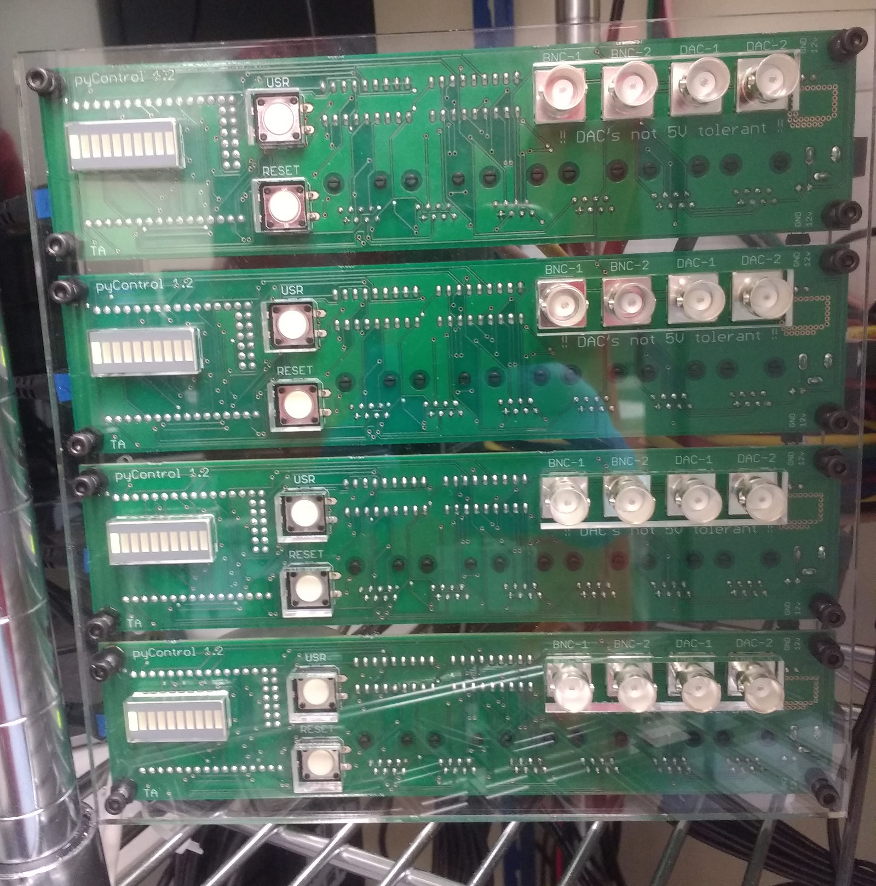

# Breakout board enclosure

Enclosures to mount the pyControl breakout board.  There are design files for 1, 2 and 4 board enclosures in the respective folders.  The DXF files are at 1 unit = 1mm scale, the PDF files are editable in illustrator.

### Assembly instructions:

1.  Laser cut the front and back panels of the enclosure in 5mm thick clear acrylic.

2.  Mount the breakout boards on the front panel using the 12mm screws and nuts with a 3mm spacer between the front panel and the boards.  For the screws in the corners of the enclosure use the 16mm standoffs rather than a nut. While mounting the boards, interconnect the 12V and GND lines of adjacent boards using the 2 way header connectors on the board edges - this allows a single 12V power supply to power all the boards in the enclosure.  

3.  Attach the back panel to the 16mm standoffs using the 8mm screws.

