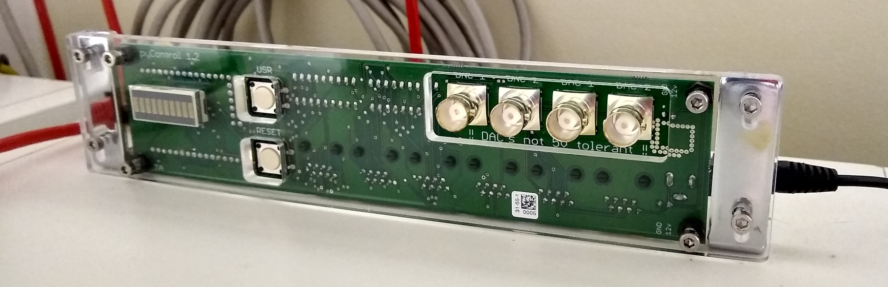
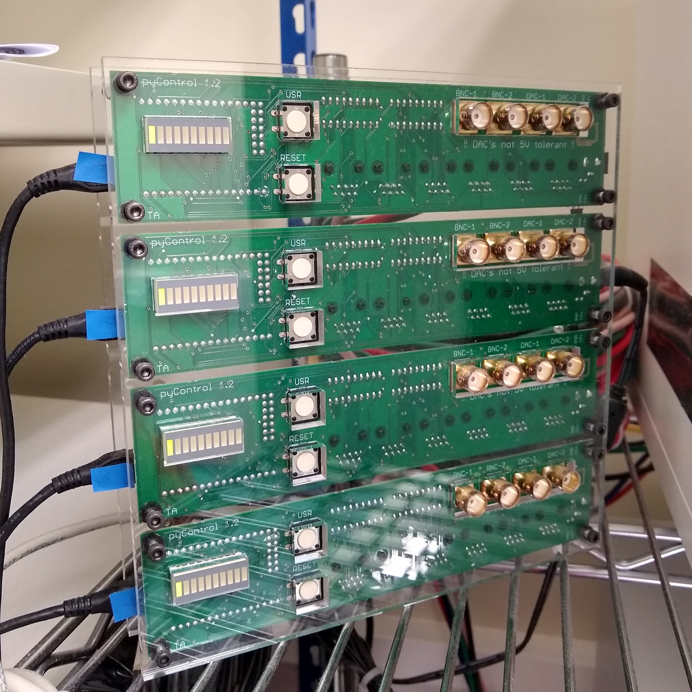

# Breakout board enclosures and brackets

### Mounting bracket

Bracket for mounting Breakout board 1.2.  We often use these to mount the board on the top of the setup's sound attenuating  chamber.

#### Assembly instructions:

1.  Laser cut the panel in clear 5mm acrylic.  The DXF files are at 1 unit = 1mm scale. 
2.  Attach breakout board to panel using 12mm M3 screws, 3mm spacers and nuts.
3.  Attach right angle brackets onto the panel with 12mm M3 bolts and nuts.
4.  For sound attenuating chambers made of melamine faced MDF the brackets can be mounted on the enclosure using wood screws.

### Enclosures

Enclosures to mount the pyControl breakout board 1.2.  There are design files for 1, 2 and 4 board enclosures in the respective folders.  

#### Assembly instructions:

1.  Laser cut the front and back panels of the enclosure in 5mm clear acrylic.  The DXF files are at 1 unit = 1mm scale.
2.  Mount the breakout boards on the front panel using the 12mm M3 screws and nuts with a 3mm spacer between the front panel and the boards.  For the screws in the corners of the enclosure use the 16mm standoffs rather than a nut. While mounting the boards, interconnect the 12V and GND lines of adjacent boards using the 2 way header connectors on the board edges - this allows a single 12V power supply to power all the boards in the enclosure.  
3.  Attach the back panel to the 16mm standoffs using the 8mm screws.
