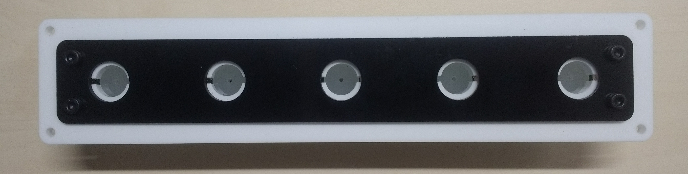
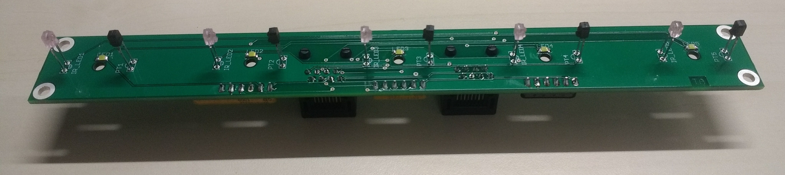

# Five poke

**Assembled**

**PCB**

A set of five nose-pokes mounted in a row on a single PCB and controlled via two behaviour ports.  Each poke consists of an infra-red beam and a stimulus LED that illuminates the back of the poke.

[Documentation](https://pycontrol.readthedocs.io/en/latest/user-guide/hardware/#five-poke)

