# 3x3 maze assembly instructions.

## Tools

- 4mm hex screwdriver
- 3mm hex screwdriver
- 2mm hex key
- knife

## 1. Base frame

**Parts needed:**

| Name                                                | Part #                                                       | Supplier  | Quantity |
| --------------------------------------------------- | ------------------------------------------------------------ | --------- | -------- |
| Base long rail                                      | HFS5-2080-660                                                | Misumi    | 2        |
| Base/top short rail                                 | HFS5-2020-620                                                | Misumi    | 5        |
| Corner bracket set (including rail nuts and bolts). | HBLFSR5-C-SSP (note - nuts and bolts may be packaged separately from the brackets with part numbers SHNTP5-5 and CBM5-10) | Misumi    | 14       |
| M5 8mm button head  screw                           | SBCB5-8                                                      | Misumi    | 10       |
| M5 post insertion nuts                              | SHNTP5-5                                                     | Misumi    | 6        |
| enclosure_top_bottom                                | enclosure3x3_top_bottom_3mm_white_ACP_660x660mm              | ACP panel | 1        |
| enclosure_base_strip                                | enclosure3x3_base_strip_3mm_black_ACP_660x58mm               | ACP panel | 2        |

Assemble the base rails as shown in the photos below

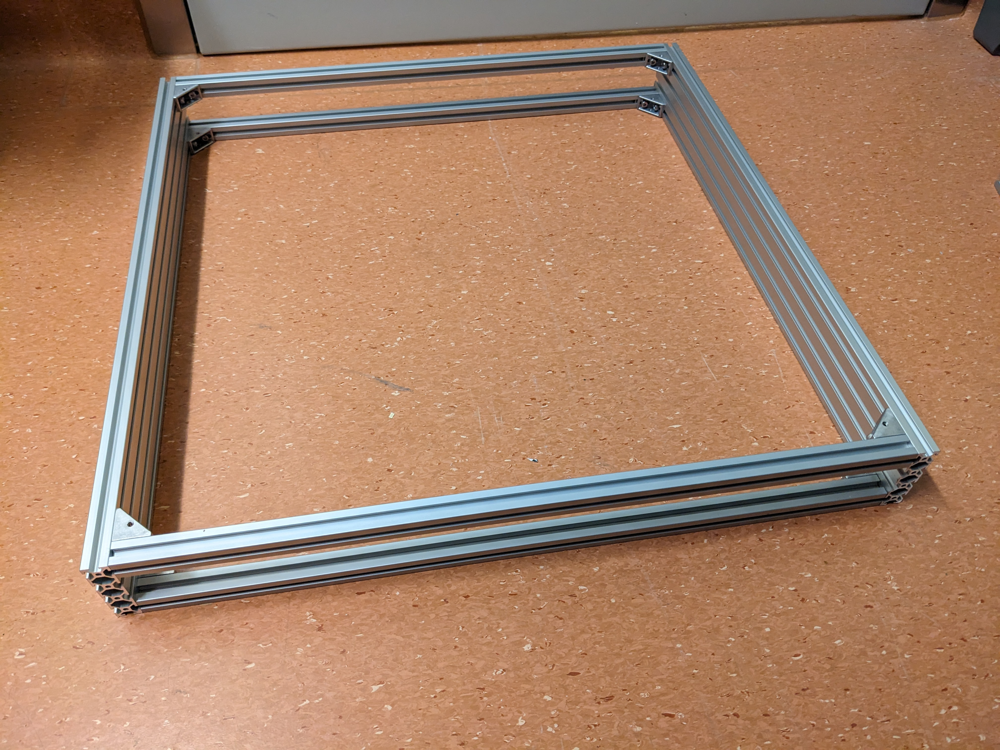

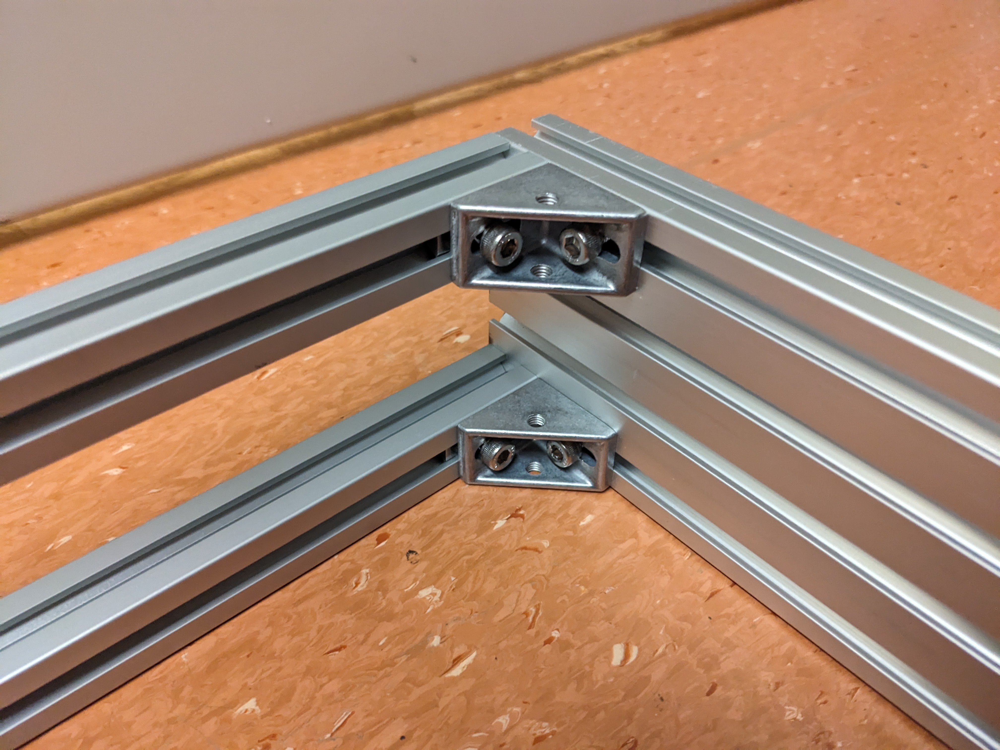

Flip the base over and attach the bottom panels (note, bottom panel should be white).

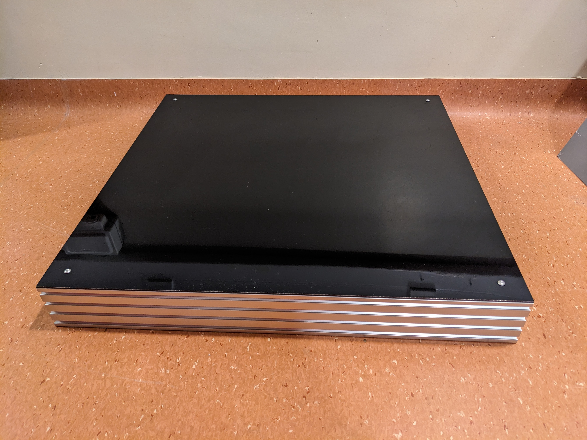

If you are using rubber feet, these should be used with 20mm M5 cap head screws to attach the base panel rather than the 8mm M5 cap head screws:

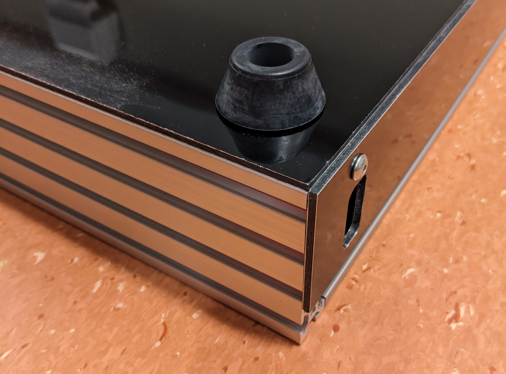

Attach the enclosure base strips using M5 8mm button head screws and rail nuts.

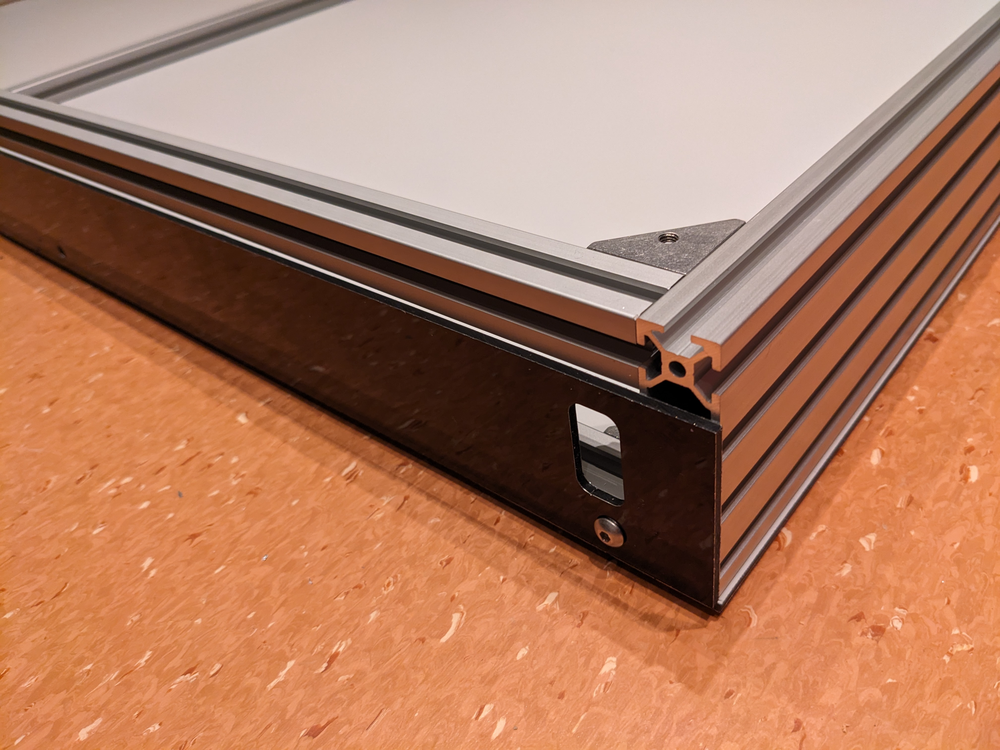

Attach rails across the top of the base, don't worry about spacing for now, leave them loose.

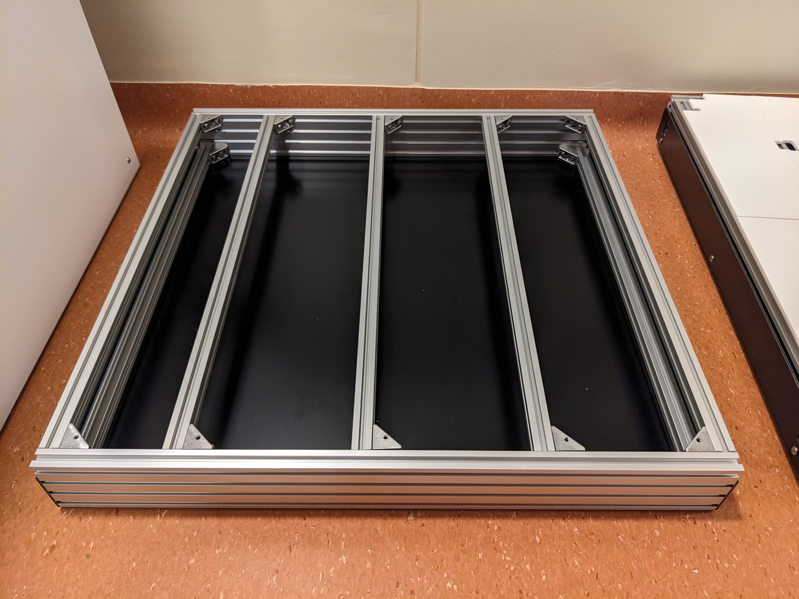

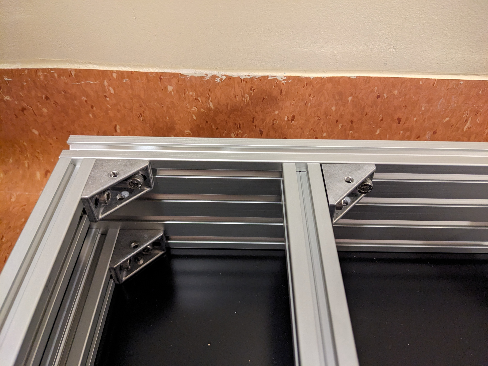

## Tower rails

| Name                | Part #                             | Supplier      | Quantity |
| ------------------- | ---------------------------------- | ------------- | -------- |
| Tower vertical rail | HFS5-2020-300-LMH-RTP              | Misumi        | 9        |
| Blind joints        | HAMJ5                              | Misumi        | 9        |
| floorA              | floorA_5mm_white_acrylic_126x328mm | Acrylic panel | 2        |
| floorC              | floorC_5mm_white_acrylic_178x328mm | Acrylic panel | 4        |
| floorF              | floorF_5mm_white_acrylic_170x328mm | Acrylic panel | 2        |

Lay out the floor panels on the base and use them to ensure the rails that support them are in the correct position.  The panels are designed to have a small gap (1-2mm) between them.

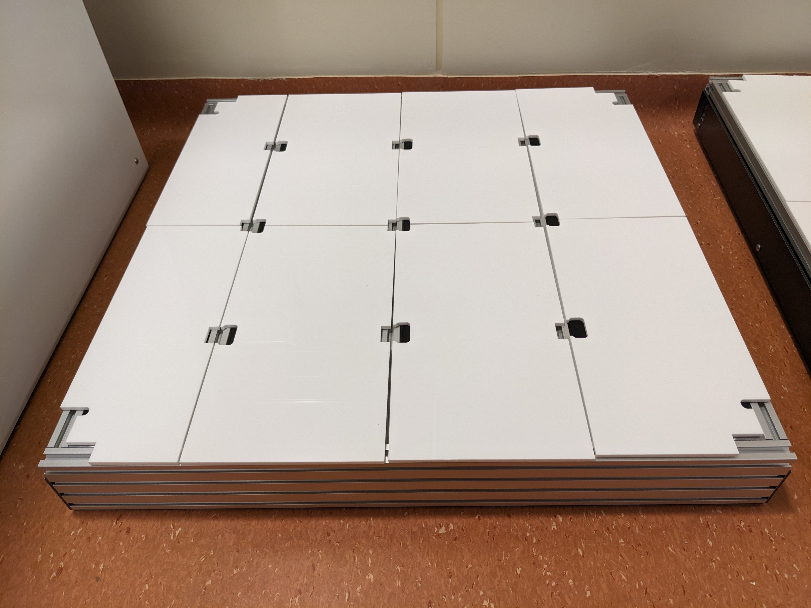

Attach the tower rails to the horizontal rails using the blind joints:

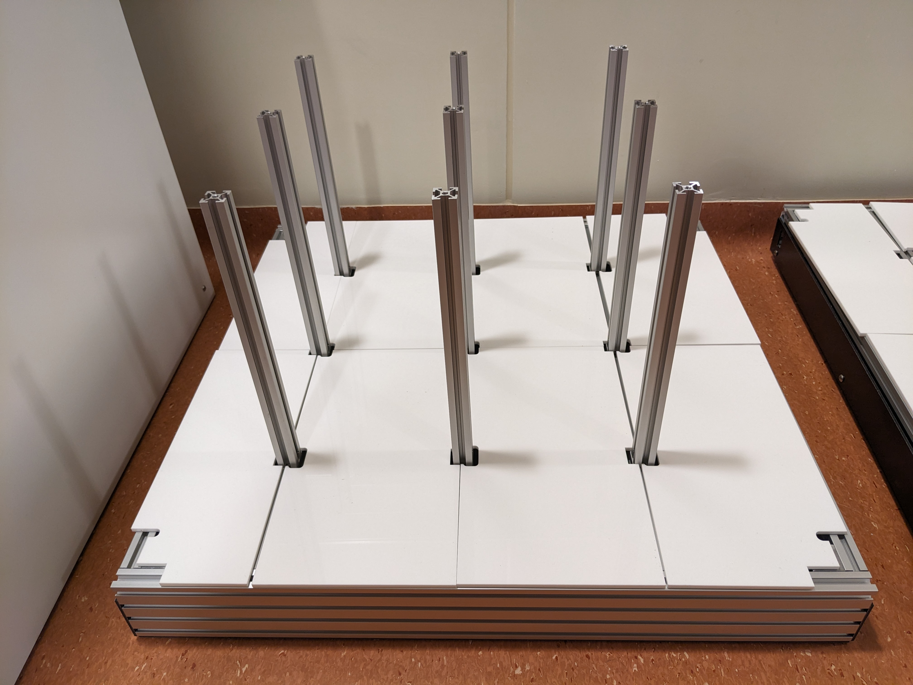

## Tower tubing and wiring

| Name                             | Part #       | Supplier | Quantity |
| -------------------------------- | ------------ | -------- | -------- |
| PVC tubing 3mm ID                | MFLX96480-01 | VWR      | 1        |
| T connector 3.2mm                | MFLX40623-65 | VWR      | 11       |
| Cat5e network cable  0.5m red    | 1734905      | Farnell  | 3        |
| Cat5e network cable 0.75m yellow | 1526172      | Farnell  | 3        |
| Cat5e network cable 1m white     | 1734863      | Farnell  | 3        |
| Cable tie 142mm x  3.2mm         | 1416041      | Farnell  | 18       |

Position the cables for the tower PCBs and tubing and attach to frame with cable ties.  

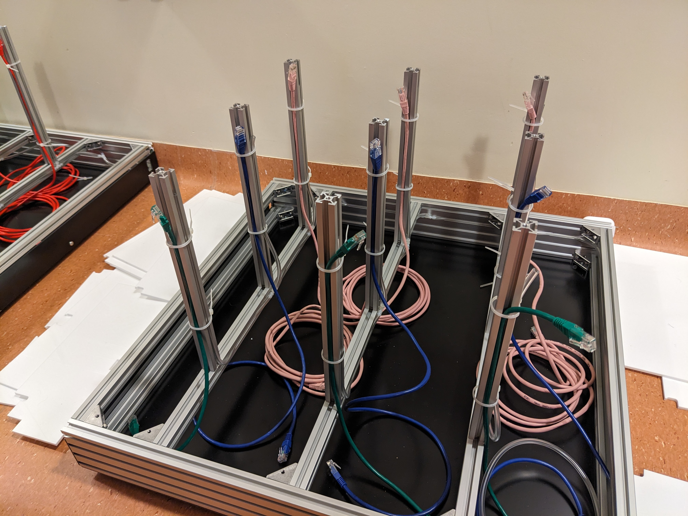

The tubing should run to the back of the maze then around the right hand side of the maze to reach the front right corner where the reservoir will be positioned.

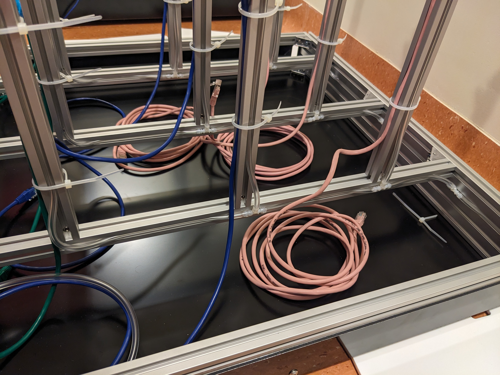

## Tower tops

| Name                            | Part #       | Supplier    | Quantity |
| ------------------------------- | ------------ | ----------- | -------- |
| Tower top assembly              | -            | -           | 9        |
| M5 10mm Nylon button head screw | SFM-M5-10-N  | Accu Group  | 9        |
| PVC tubing 1.6mm ID             | MFLX96480-00 | VWR         | 1        |
| 3.2 to 1.6mm tubing adaptor     | MFLX40622-22 | VWR         | 9        |
| Solenoid Valve                  | LHDB1233518H | Lee Company | 9        |

The solenoid valves have one inlet port flanked by two outlet ports, with the inlet connected to the outlet closest to the value body when the valve is not powered, and to the outlet furthest from the valve body when the valve is powered.  It is necessary to seal the outlet closest to the valve body as we only use the inlet and the outlet furthest from the valve body (see image below).   This can be done using a small blob of epoxy.  Apply the epoxy with the outlet in a horizontal position and leave valve positioned with outlet horizontal while epoxy dries to avoid epoxy running into valve.

After extra outlet has been sealed, position solenoid valves in connectors on tower PCBs.

See separate assembly docs for tower top assembly.  Attach tower top assemblies to tower rails with M5 10mm bolts, connect cable and tubing as shown in photo below.

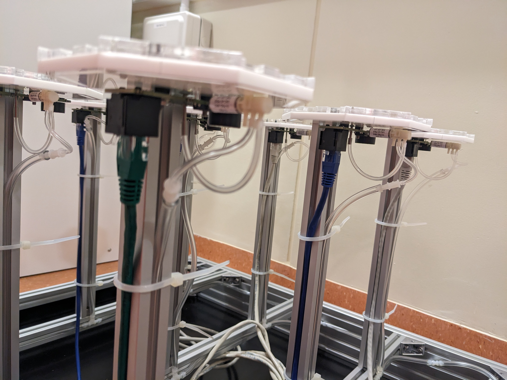

## Control PCBs

| Name                             | Part #    | Supplier | Quantity |
| -------------------------------- | --------- | -------- | -------- |
| Maze_hub PCB                     | -         | -        | 1        |
| Maze expander PCB                | -         | -        | 1        |
| M3 post insertion nut            | HNTFSN5-3 | Misumi   | 4        |
| M3 x 16mm cap head  screw        | SCB3-16   | Misumi   | 4        |
| spacer 8mm diameter  11mm length | 2987712   | Farnell  | 4        |

Attach Control PCBs to base rail on front size of maze using M3 bolts and spacers.  Ensure connector between Maze_hub and Maze expander is connected correctly.  Pug tower cables into control boards.

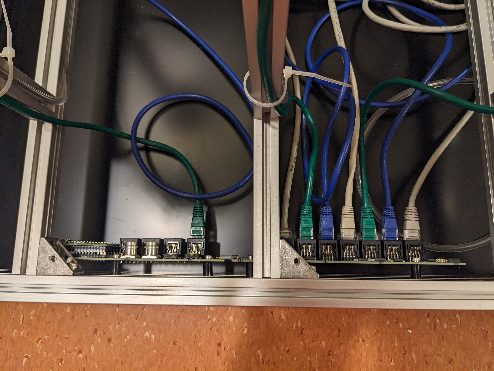

## Enclosure frame

| Name                                   | Part #        | Supplier | Quantity |
| -------------------------------------- | ------------- | -------- | -------- |
| Top long side rail                     | HFS5-2020-660 | Misumi   | 2        |
| Base/top short rail                    | HFS5-2020-620 | Misumi   | 3        |
| Frame vertical  rail                   | HFS5-2020-700 | Misumi   | 4        |
| Corner bracket ( rail nuts and bolts). | HBLFSR5-C-SSP | Misumi   | 22       |

Construct enclosure frame.  Note - Photo below does not show additional horizontal rail across the center of the top for camera mounting, see image in section *Camera and IR components* for photo.

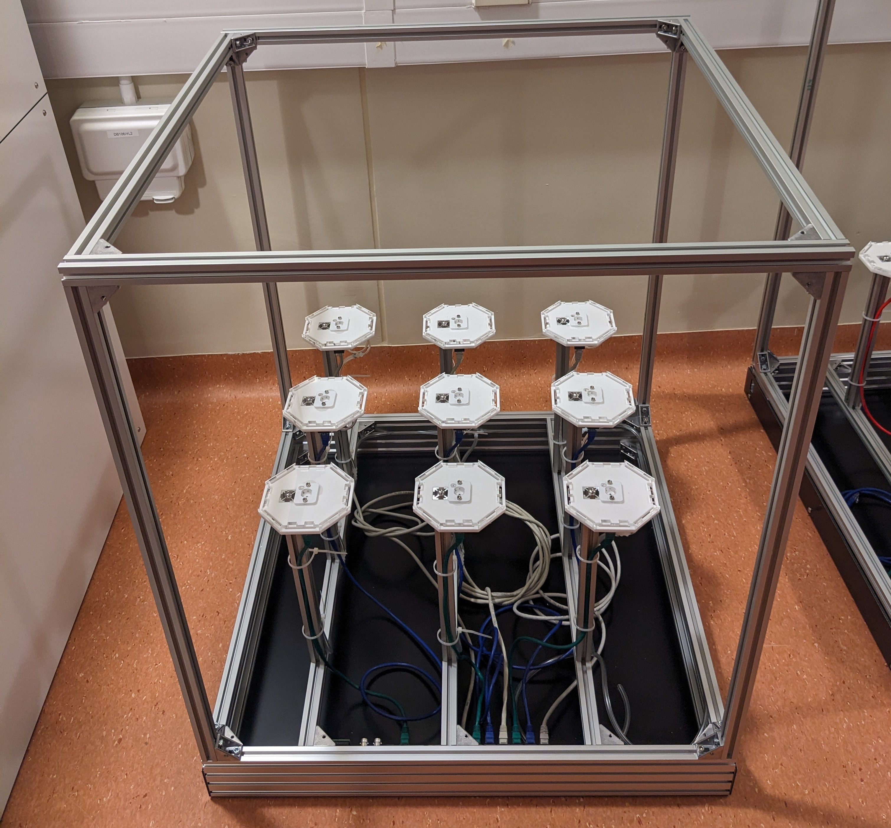

## Enclosure panel and doors

| Name                        | Part #   | Supplier | Quantity |
| --------------------------- | -------- | -------- | -------- |
| enclosure_door              | -        | -        | 2        |
| enclosure_door_side_strip   | -        | -        | 2        |
| enclosure_door_center_strip | -        | -        | 1        |
| Door handle                 | UPCDG90  | Misumi   | 2        |
| Door handle nut             | HHPUW90  | Misumi   | 2        |
| M6 x 12mm socket head screw | CBM6-12  | Misumi   | 4        |
| Detachable hinge  left      | HHPNL5   | Misumi   | 2        |
| Detachable hinge  right     | HHPNR5   | Misumi   | 2        |
| Hinge nuts                  | HHPNT5-2 | Misumi   | 4        |
| Countersunk M5 12mm  screw  | SFB5-12  | Misumi   | 16       |
| M5 nut                      | SLBNR5   | Misumi   | 3        |
| M5 8mm button head screw    | SBCB5-8  | Misumi   | 3        |
| Magnetic catch for doors    | HMGNA5   | Misumi   | 1        |

Attach enclosure side and top panels to frame using M5 8mm button head screws.  Note, top panel should be white, not black as shown in photo as this greatly improves illumination inside maze.

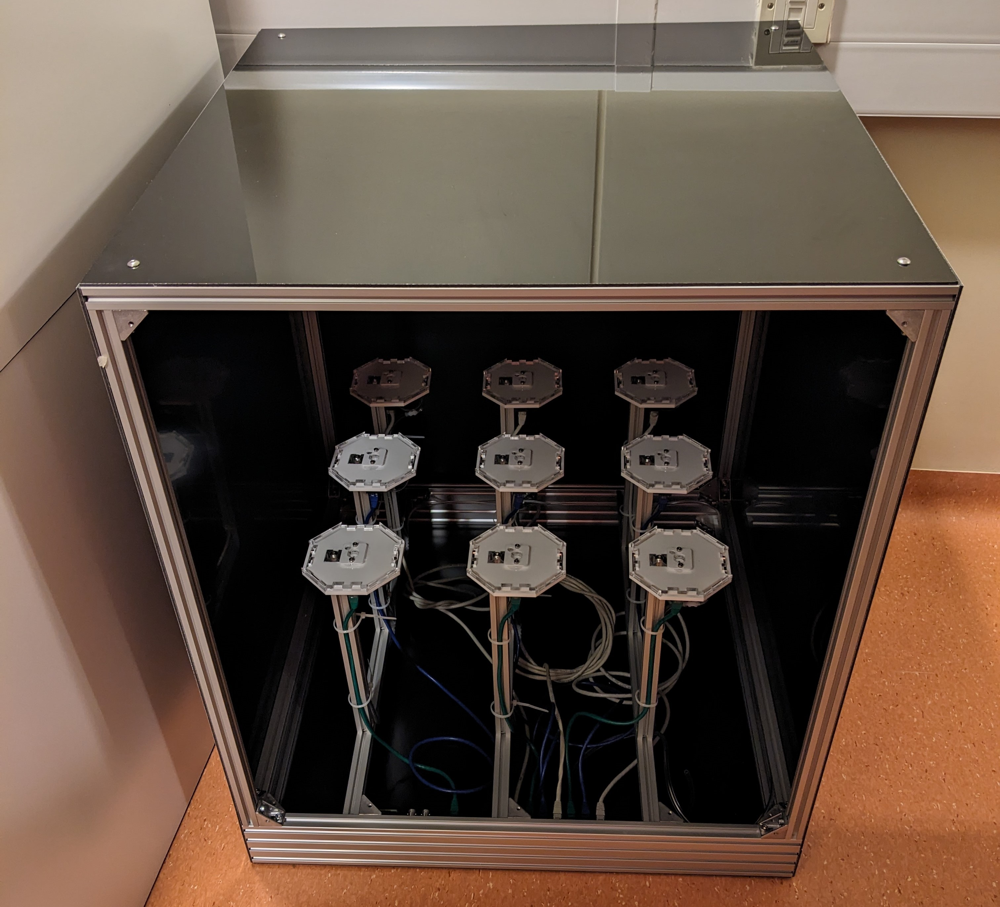

Attach handles to door panels, attach door center strip to left door with M5 8mm button head screws and nuts, attach door and door side strips to frames with hinges using M5 12mm countersunk screws and rail nuts.  Attach magnetic catch to top of outer door and enclosure frame.

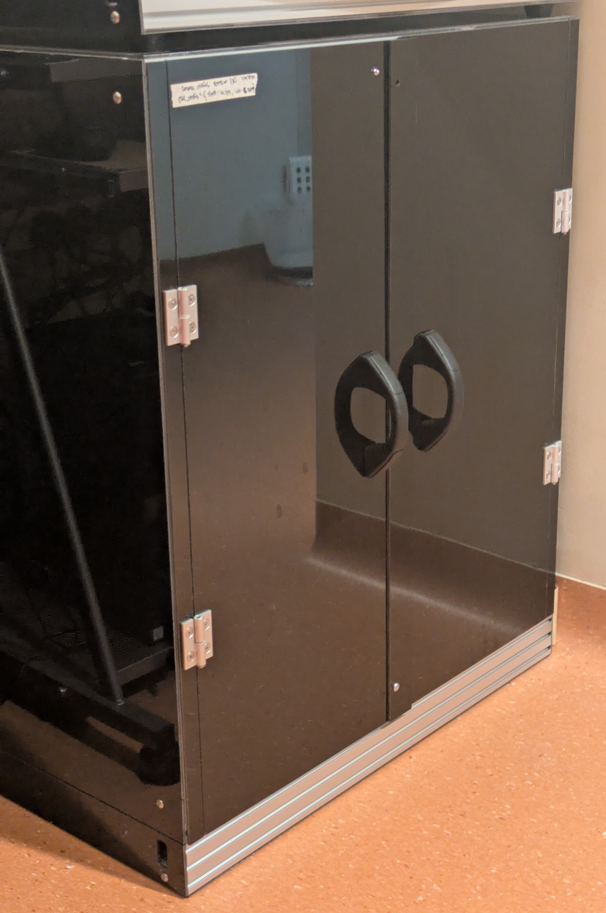

## Camera, IR illumination, reservoir

| Name                          | Part #            | Supplier   | Quantity |
| ----------------------------- | ----------------- | ---------- | -------- |
| Uplighter rail                | HFS5-2020-200     | Misumi     | 2        |
| Uplighter 45 degree bracket   | HBL45TS5-SSP      | Misumi     | 2        |
| Corner bracket kit            | HBLFSR5-C-SSP     | Misumi     | 2        |
| Bracket for camera attachment | HBLSS6            | Misumi     | 1        |
| M5 post insertion nut         | SHNTP5-5          | Misumi     | 1        |
| M5 10mm Cap head bolt         |                   | Misumi     | 1        |
| Screw 1/4-20 UNC 3/8"         | SSC-1/4-20-3/8-A2 | Accu Group | 1        |
| Mini Ball Head camera mount   |                   |            |          |
| IR LED modules and cables     |                   |            |          |
| Camera, lens and cable        |                   |            |          |

Position IR LEDs as uplighters on side of maze using rails and 45 degree brackets.

Position camera above maze using right angle bracket and mini-ball head camera mount.

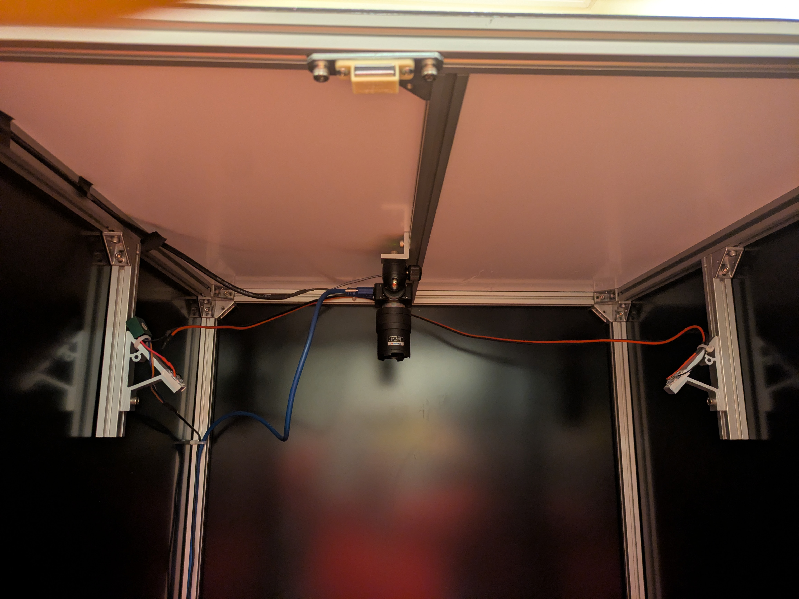

Position reservoir on right hand side of maze near door and connect to tubing.  Note, the photo below shows the reservoir positioned on a load cell for automatically calibrating release volumes, this calibration hardware is detailed seperately.

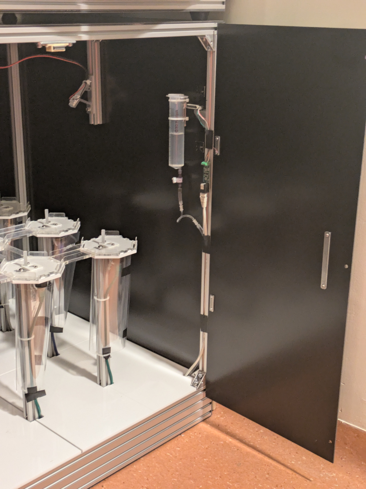

