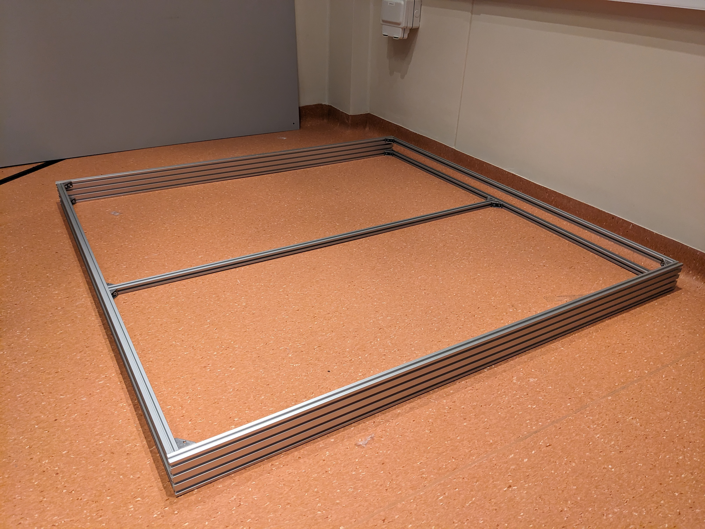
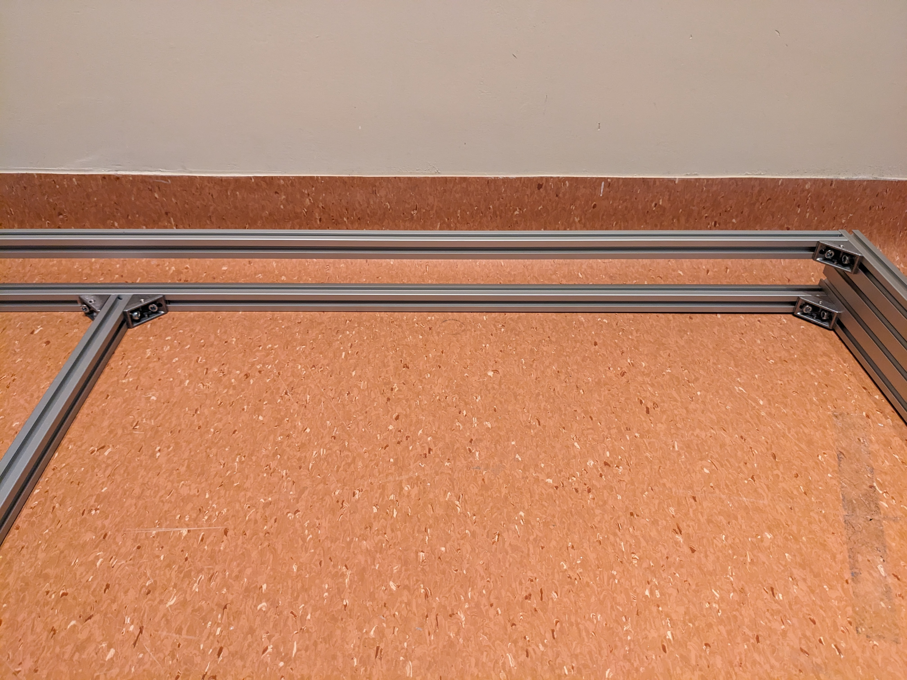
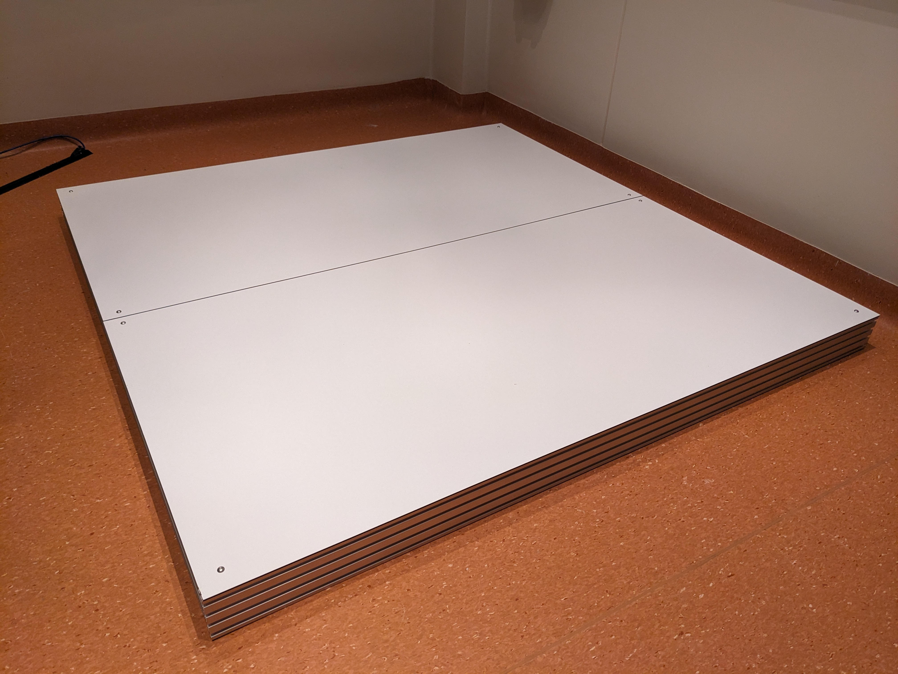
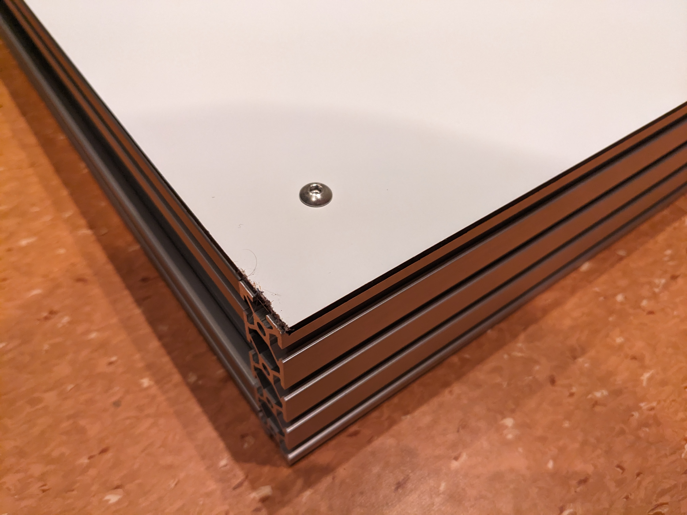
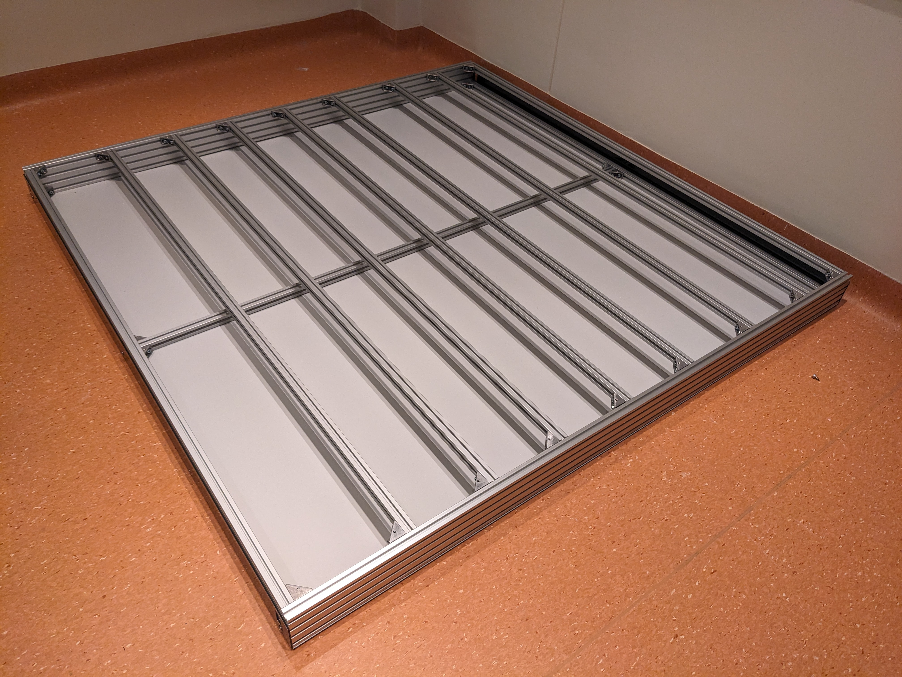
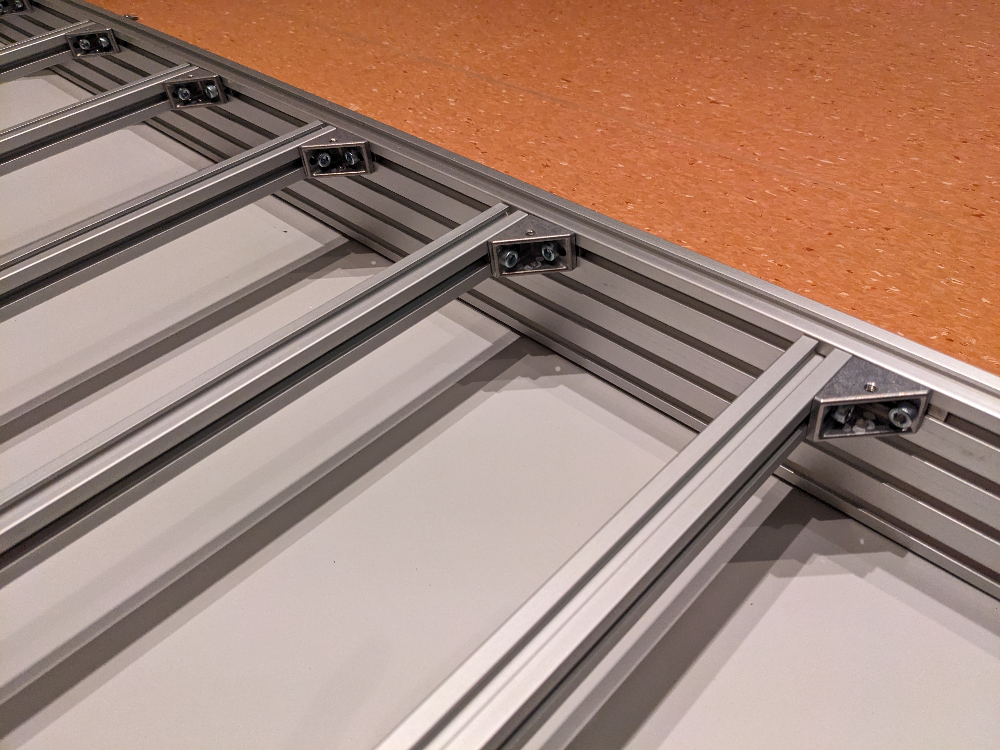
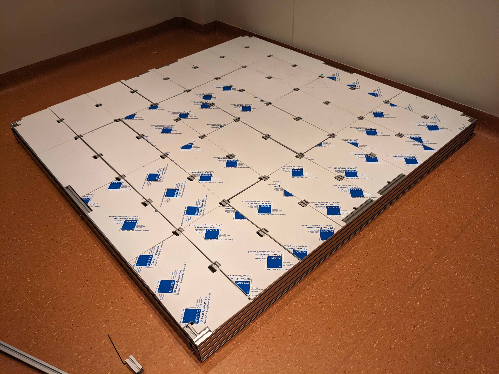
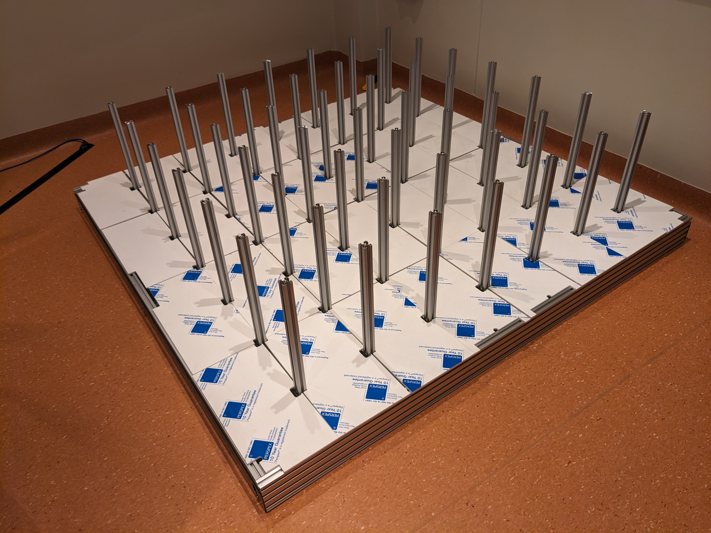

# 7x7 maze assembly instructions.

## Tools

- 4mm hex screwdriver
- 3mm hex screwdriver
- 2mm hex key
- knife

## 1. Base frame

**Parts needed:**

| Name                                                       | Part #                                                       | Supplier  | Quantity |
| ---------------------------------------------------------- | ------------------------------------------------------------ | --------- | -------- |
| Base long rail                                             | HFS5-2080-1380                                               | Misumi    | 2        |
| Base/top short rail                                        | HFS5-2020-1340                                               | Misumi    | 12       |
| Corner bracket (including associated rail nuts and bolts). | HBLFSR5-C-SSP (note - nuts and bolts may be packaged separately from the brackets with part numbers SHNTP5-5 and CBM5-10) | Misumi    | 26       |
| M5 8mm button head  screw                                  | SBCB5-8                                                      | Misumi    | 18       |
| M5 post insertion nuts                                     | SHNTP5-5                                                     | Misumi    | 10       |
| enclosure_top_bottom                                       | enclosure7x7_top_bottom_3mm_white_ACP_1380x689mm             | ACP panel | 12       |
| enclosure_base_strip                                       | enclosure7x7_base_strip_3mm_black_ACP_1380x58mm              | ACP panel | 2        |

Assemble the base rails as shown in the photos below

Flip the base over and attach the bottom panels

Attach the enclose base strips:

Attach rails across the top of the base, don't worry about spacing for now, leave them loose.

## Tower rails

| Name                | Part #                             | Supplier      | Quantity |
| ------------------- | ---------------------------------- | ------------- | -------- |
| Tower vertical rail | HFS5-2020-300-LMH-RTP              | Misumi        | 49       |
| Blind joints        | HAMJ5                              | Misumi        | 49       |
| floorA              | floorA_5mm_white_acrylic_126x328mm | Acrylic panel | 2        |
| floorB              | floorB_5mm_white_acrylic_126x358mm | Acrylic panel | 2        |
| floorC              | floorC_5mm_white_acrylic_178x328mm | Acrylic panel | 8        |
| floorD              | floorD_5mm_white_acrylic_178x328mm | Acrylic panel | 4        |
| floorE              | floorE_5mm_white_acrylic_178x358mm | Acrylic panel | 12       |
| floorF              | floorF_5mm_white_acrylic_170x328mm | Acrylic panel | 2        |
| floorG              | floorG_5mm_white_acrylic_170x358mm | Acrylic panel | 2        |

Lay out the floor panels on the base and use them to ensure the rails that support them are in the correct position.  The panels are designed to have a small gap (1-2mm) between them.

Attach the tower rails to the horizontal rails using the blind joints:

## Tower tubing and wiring

| Name                             | Part #       | Supplier | Quantity |
| -------------------------------- | ------------ | -------- | -------- |
| PVC tubing 3mm ID                | MFLX96480-01 | VWR      | 30m      |
| T connector 3.2mm                | MFLX40623-65 | VWR      | 48       |
| Cat5e network cable  0.5m red    | 1734905      | Farnell  | 7        |
| Cat5e network cable 0.75m yellow | 1526172      | Farnell  | 7        |
| Cat5e network cable 1m white     | 1734863      | Farnell  | 7        |
| Cat5e network cable 1.25m green  | 1526189      | Farnell  | 7        |
| Cat5e network cable 1.25m blue   | 1526158      | Farnell  | 7        |
| Cat5e network cable 1.5m pink    | 1525671      | Farnell  | 7        |
| Cat5e network cable 2m purple    | 1525649      | Farnell  | 7        |
| M3 cable tie mount               | 1773450      | Farnell  |          |
| Cable tie 142mm x  3.2mm         | 1416041      | Farnell  |          |
| M3 post insertion  nut           | HNTFSN5-3    | Misumi   |          |
| Countersunk M3 8mm  screw        | SFB3-8       | Misumi   |          |

## Assembly notes:

- Reduce number of screws holding base side strip from 5 to 3.