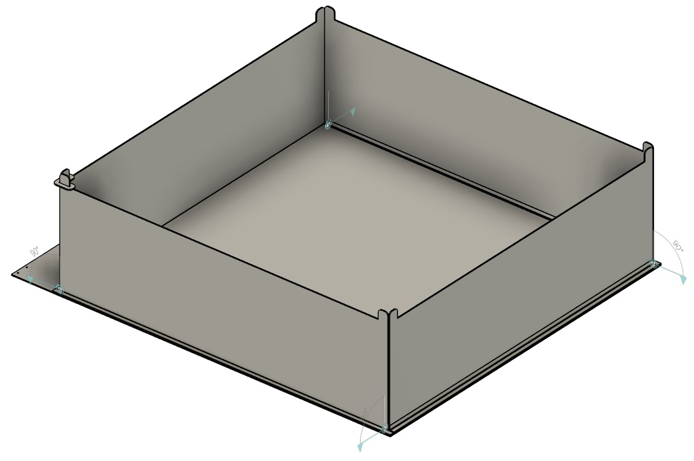
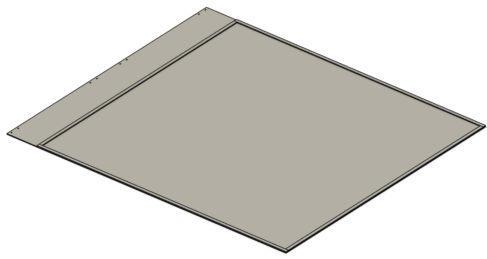
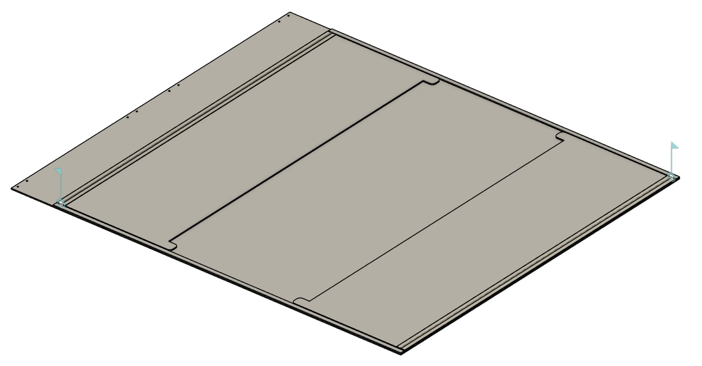
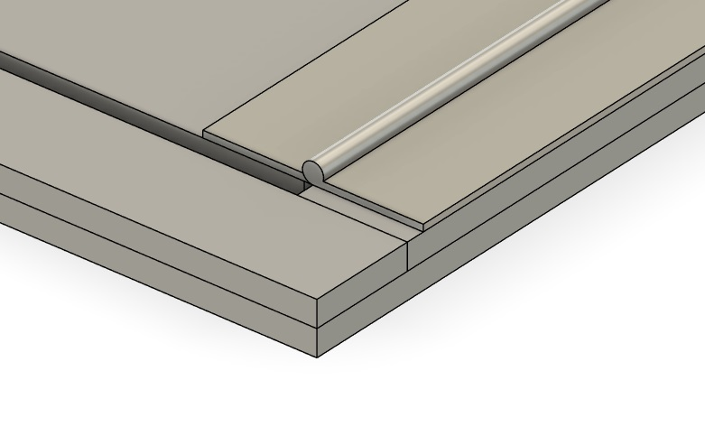
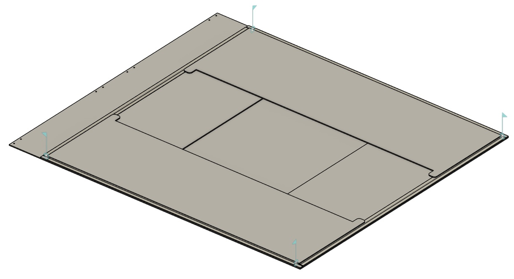
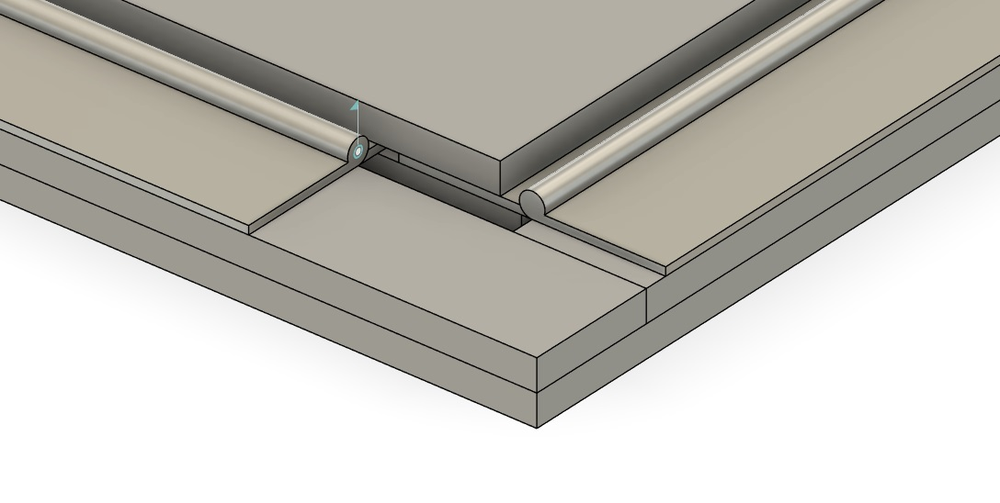
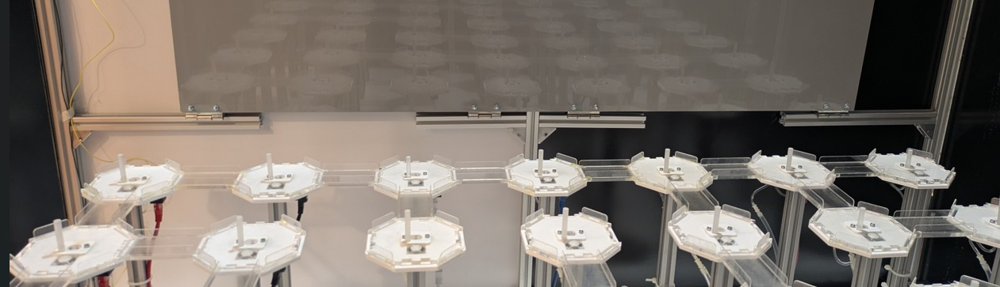
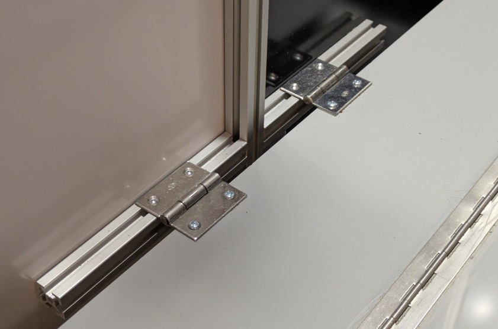
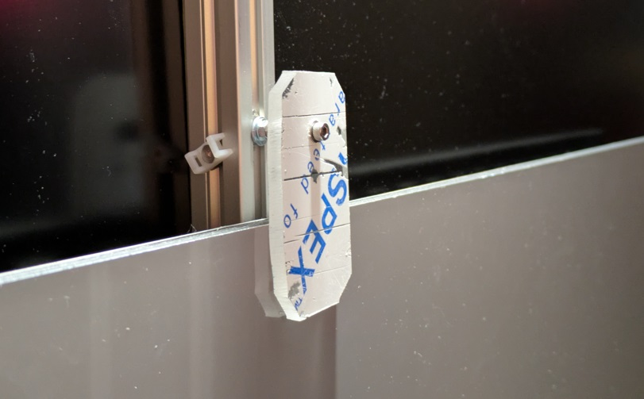

# Maze open field insert

The open field insert is an open field made of ACP panels connected with piano hinges which folds flat and can be mounted on the wall of the 7x7 maze enclosure and folded down when needed.

### Assembly instructions

1. Stick the parts *hinge_strip_short* and *hinge_strip_long* to the *base* using *GPT-020 double sided tape*.  The long strips go along the long side of the base as shown below.  To ensure a strong bond when taping parts, roughen the surfaces to be bonded using sand paper and then clean with isopropyl alcohol before applying tape.  Apply tape first to base, then bond strip to base starting at one end and lowering into position, progressively making contact along the strip.  Apply firm pressure to bond at all points along length once part is in position.

   

2. Attach parts *wall_short* to *hinge_strip_short* using *piano hinges* attached to the panels with double sided tape.  Attach hinge first to strips, then to walls.

   

   

3. Attach parts *wall_long* to the *hinge_strip_long* using *piano hinges* attached to the panels with double sided tape.  After walls are glued in position, check they can be folded up and secured in position using the *joint* parts over the corners.

   

   

4.  Mount the open field in the maze using the *butt hinges* and *M4 cap head bolts and nuts*.

   

   

5. Make a catch to secure the open field in an upright position when not in use using the *20mm M4 bolt* and *10mm spacer* to attach a piece of acrylic to the maze frame.

   

