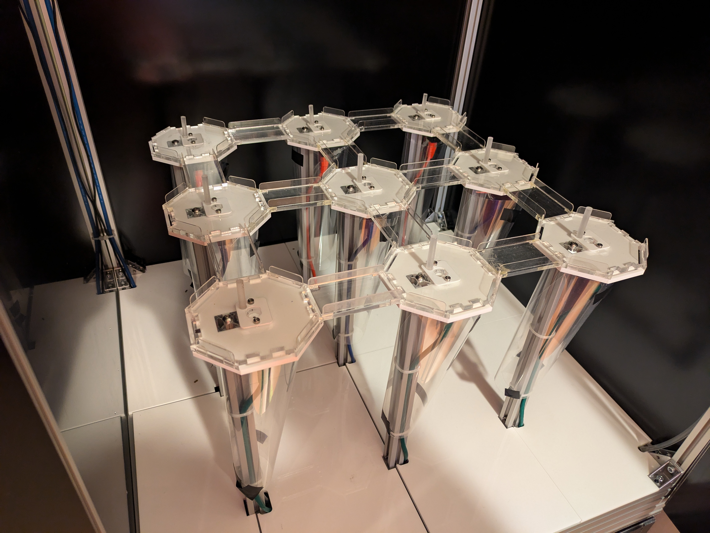

# GridMaze hardware

GridMaze is a computer controlled elevated maze apparatus for mouse behavioural experiments consisting of a grid of towers interconnected by walkways.  Each tower is equipped with an LED for visual cueing, a speaker for auditory stimuli, and a nose-poke port for reward delivery. 

The towers, walkways and floor of the maze are assembled from laser-cut plastic, the frame from aluminium extrusion and brackets, and the enclosure from CNC cut aluminium composite panel.

The control electronics consist of a *maze_hub* PCB with a pyboard microcontroller running pyControl, a set of *maze_expander* PCBs each of which has 8 behaviour ports for connecting towers, and one *maze_poke* per tower with LED, speaker, IR beam and solenoid.  Up to 8 maze_expanders can be connected to one maze_hub allowing control of setups with up to 68 towers. 

This repository contains design files for a 3x3 version of the grid maze including enclosure, but the design can straightforwardly be adapted to create larger setups.