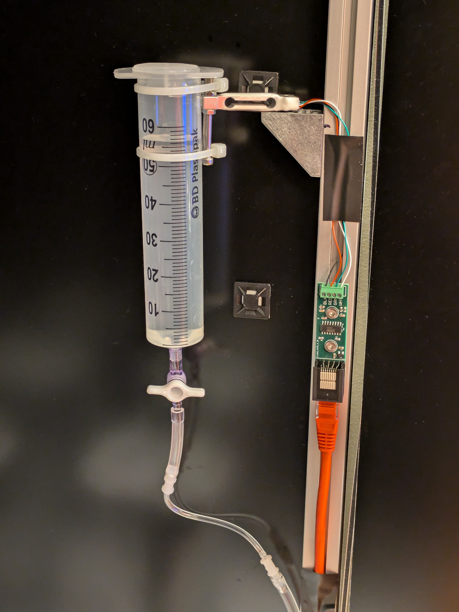

# Solenoid autocalibration



We use an automatic calibration system to avoid having to manually calibrate the large number of solenoids on grid maze setups.  This works by mounting the fluid reservoir on a load cell connected to a pyControl [loadcell amplifier](https://github.com/pyControl/hardware/tree/master/Load_cell) board, which is connected to the maze hub board.  This enables the pyboard controlling the maze to measure the weight of the reservoir, and hence determine how much water is released when a solenoid is opened.  The file `load_cell_assembly_BOM` details the components needed to mount the fluid reservoir on the load cell.  The code folder contains a pyControl task file `autocalibration_task.py` which is run on the maze using pyControl, and an analysis module called `autocalibration_script.py` which is used to analyze the data to generate linear fits mapping the desired release volume in uL to the release duration in ms.

##  Autocalibration procedure

1. Upload the task to the maze, enter a subject ID so the data is saved, and run the task.

2. Ensure the reservoir is full.

3. Open the *'Controls'* dialog and trigger the event `tare` to zero the load cell.

4. Calibrate the load cell using a known calibration weight:

   i. Get a small object of known weight (e.g. a coin) and place on top of the reservoir.

   ii. Using the controls dialog, set variable `calibration_weight` to the weight of the object, then trigger the event `calibrate` to calibrate the load cell. You can check the load cell is correctly calibrated by triggering the `weigh` event with the object on and off the reservoir.

   iii. Remove the object from the reservoir.

5. Trigger the `go` event to start the calibration, the task will cycle through all the solenoids triggering a specified number of releases for each of a set of specified release durations and measuring the weight change of the reservoir.

6. When the calibration process has finished, stop the task and remove the released water from the ports using a syringe.

7. Transfer the pyControl data file to the folder `autocalibration_data`, then run the python script `autocalibration_script.py` to generate the linear fits used for solenoid calibration (see the module docstrings for more information).  The calibration results are saved in the `autocalibration_results` folder as a text file containing a python dict with the slope and intercept of a linear fit for each poke mapping the desired release volume in uL to the release duration in ms.  For the 3x3 mazes these can be saved as a [hardware variable](https://pycontrol.readthedocs.io/en/latest/user-guide/programming-tasks/#special-variables), for the 7x7 mazes storing the solenoid calibration data as a hardware variable can cause out of memory errors and putting the calibration dict directly in the task file or in a device driver class can be preferable.  To use the calibration data to generate the release duration needed for a given reward volume we typically define the following function in the task file:

   ```python
   def get_reward_duration_ms(reward_volume_ul, current_tower):
       # Get solenoid on duration given reward volume.
       slope = v.hw_solenoid_calibration[current_tower]["s"]
       intercept = v.hw_solenoid_calibration[current_tower]["i"]
       return reward_volume_ul * slope + intercept
   ```

   

