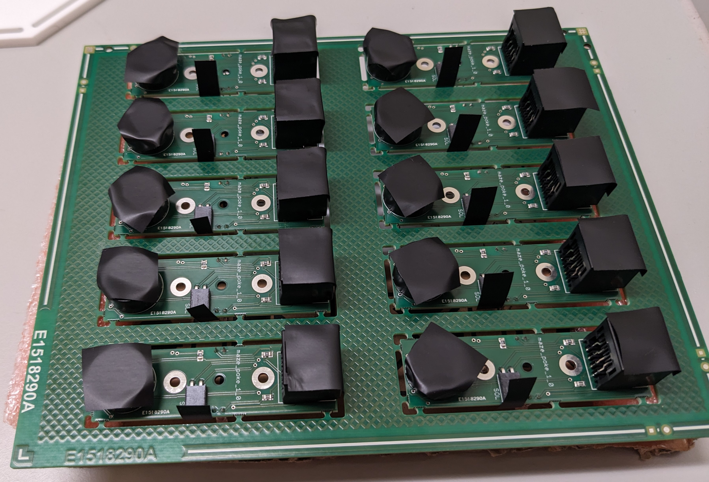
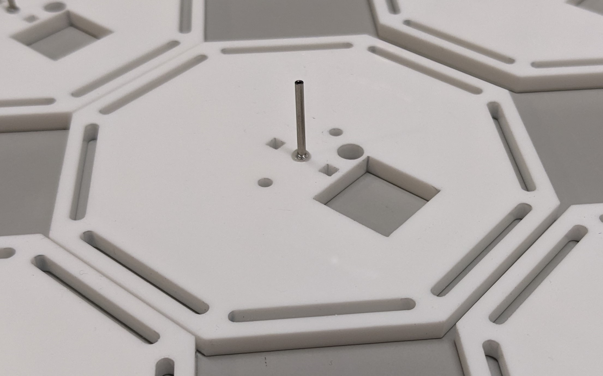
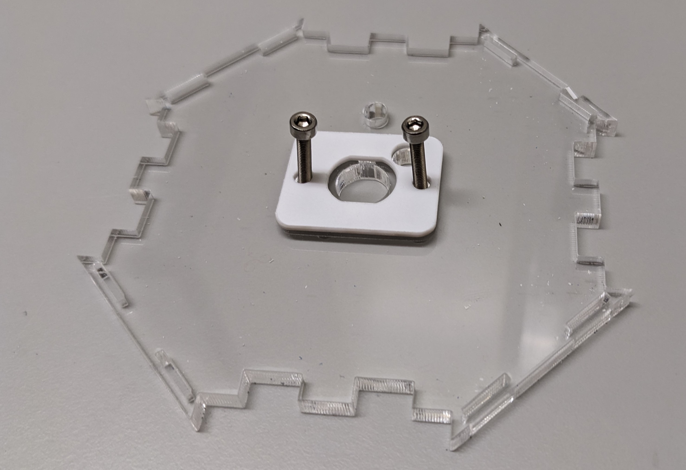
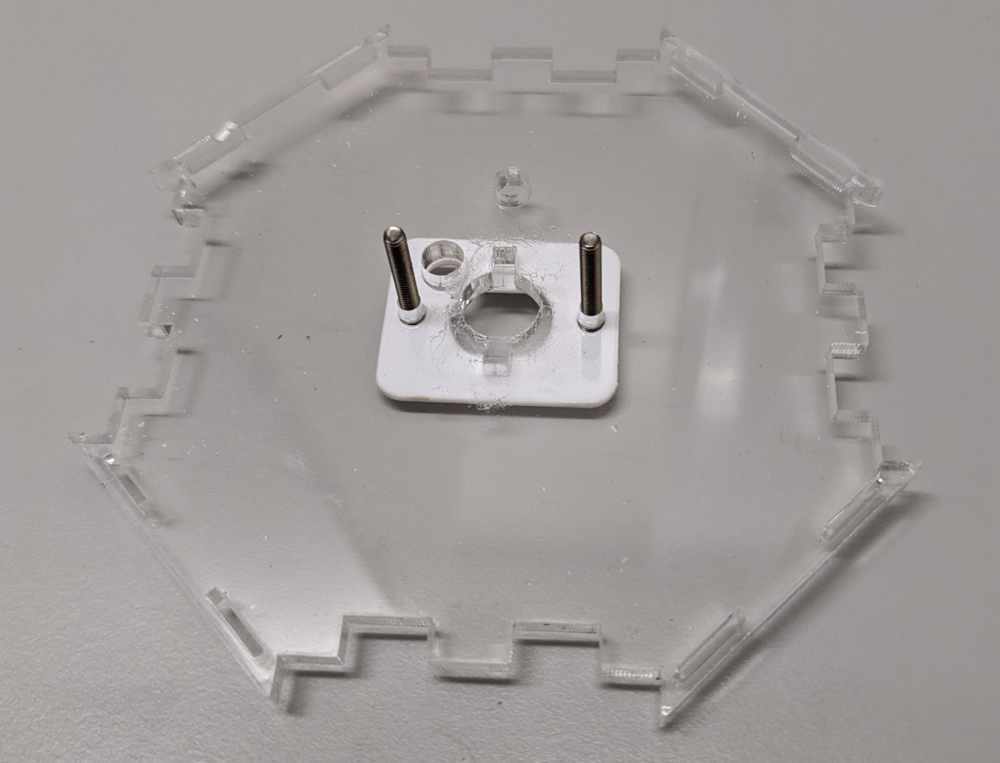
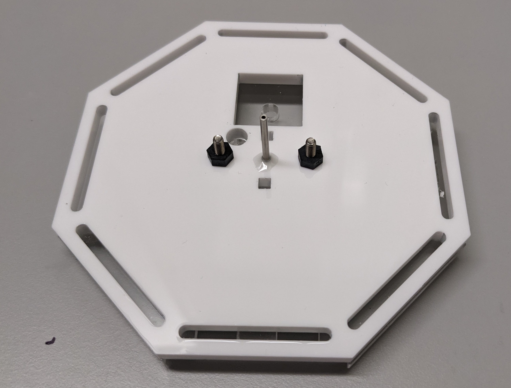
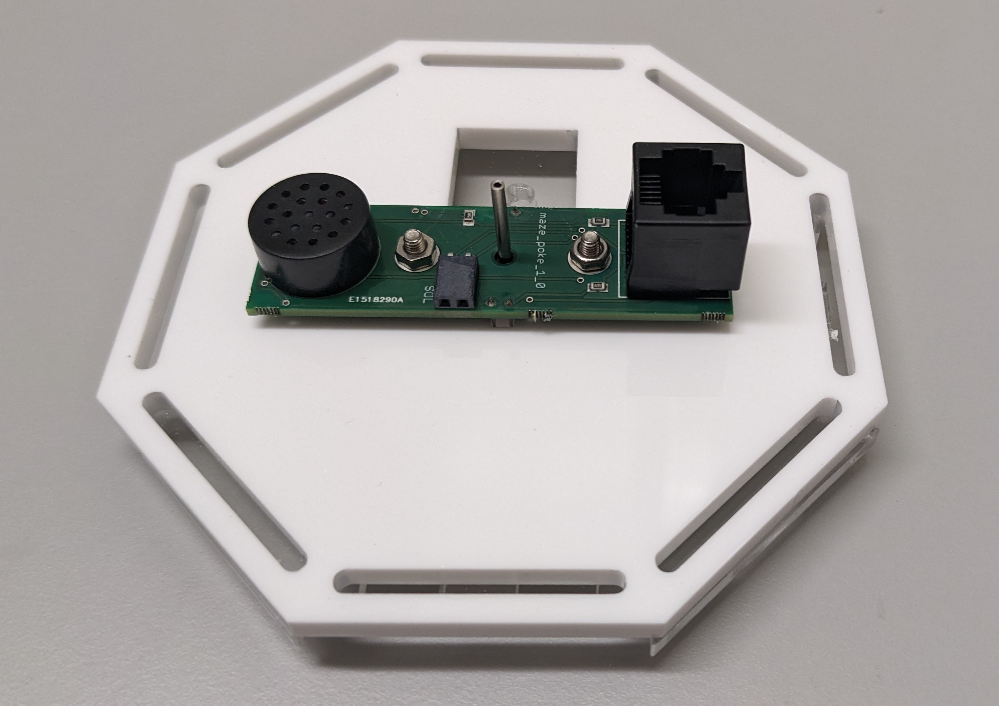
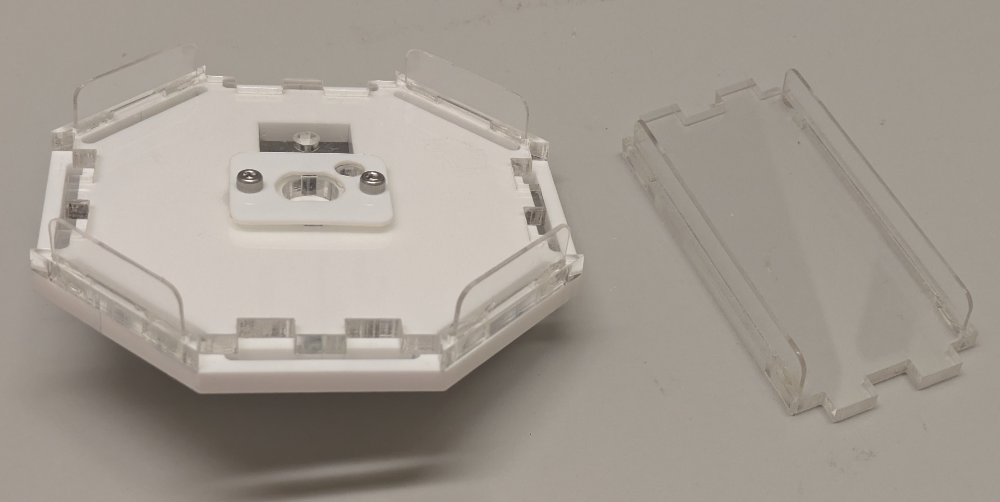

# Tower assembly instructions

## Tools and equipment

- Electrical tape
- Conformal coating spray, e.g. Ambersil 30235-AB acrylic conformal coating spray.
- 2.5mm Hex key
- Pliers
- Two part epoxy
- Vaseline

## 1. PCB conformal coating

Apply a conformal coating to tower PCBs to protect from water damage.  Before spraying the PCBs, cover the connectors and speaker with electrical tape as shown in the photo above.  Apply the conformal coating to both sides of the PCBs in a well ventilated area, using appropriate PPE.

## 2. Fluid delivery tube

Glue the fluid delivery tube into part *tower1_5mm_white_acrylic_110_x_110mm* using epoxy.  Check the orientation of the part carefully to ensure the tube is located on the correct side.  The tube should be sitting in the hole in the acrylic part with the end of the tube flush with the surface of acrylic that will form the bottom of the nose-poke (i.e. the under-side in the photo below).

## 3. Assembly

Position part *tower3_1mm_white_HIPS_28x34mm* on part *tower2_5mm_clear_acrylic_110_x_110mm* and locate 20mm M3 Cap head bolts in holes.  

Flip assembly over and apply a thin layer of Vaseline around the hole in the center; this forms a water-tight seal around the base of the poke.

Position part  *tower1_5mm_white_acrylic_110_x_110mm* on the assembly and add 3mm spacers.

Position the PCB on the assembly and secure in place with M3 nuts.

Glue parts *tower_side_1mm_clear_PETG_36x15mm* into slots in tower top with epoxy.  For walkway assembly, glue parts *walk_side_1mm_clear_PETG_76x15mm* into slots in part *walk_5mm_clear_acrylic_90_x_44mm* with epoxy.

