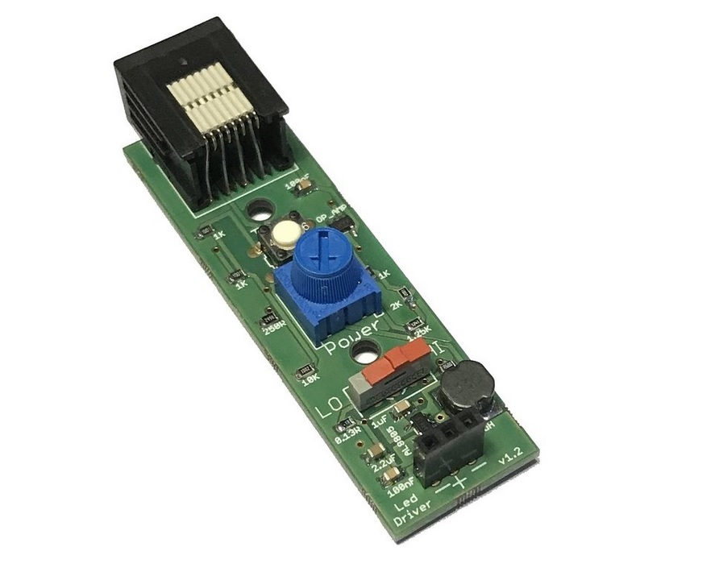

# LED driver

A constant current LED driver for optogenetic stimulation.  The LED current can be manually adjusted between 0.03 and 0.8A using controls on the board.  The LED driver plugs into any behaviour port on the breakout board.

[Documentation](https://pycontrol.readthedocs.io/en/latest/user-guide/hardware/#led-driver)

