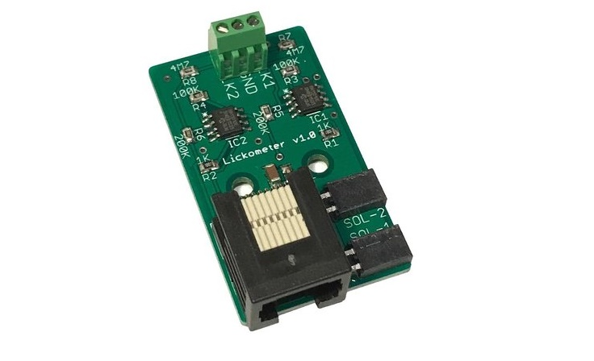

# Lickometer

An electrical lickometer board with has two lick detection circuits and two ports for controlling 12V solenoids.

[Documentation](https://pycontrol.readthedocs.io/en/latest/user-guide/hardware/#lickometer)

