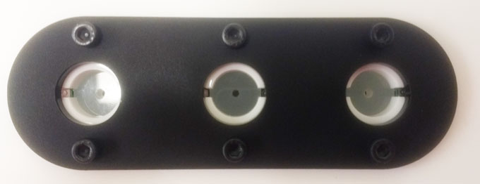
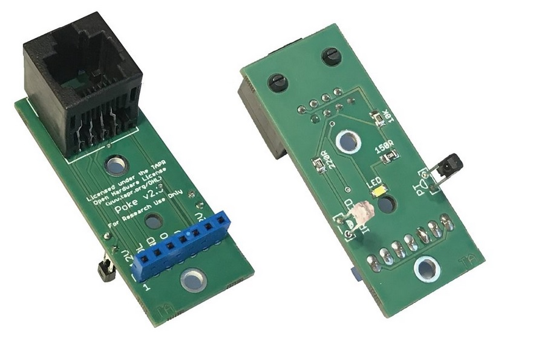

# Nose poke

**Mounted**

**PCB**

A nose-poke port with infra-red beam, stimulus LED and socket to connect solenoid valve for reward delivery.

[Documentation](https://pycontrol.readthedocs.io/en/latest/user-guide/hardware/#poke)