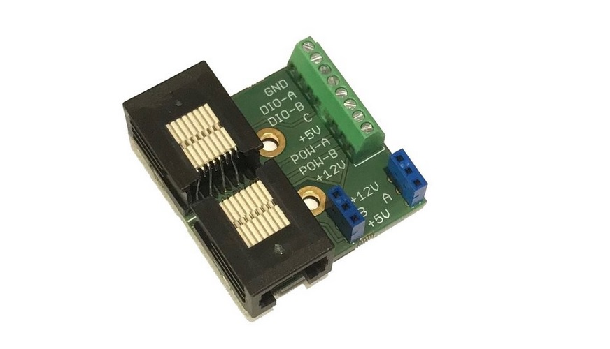

#  Pass through adapter

Board that is connected between the breakout board and a connected device allowing connection to unused lines on the behaviour port via a screw terminal and header connectors.