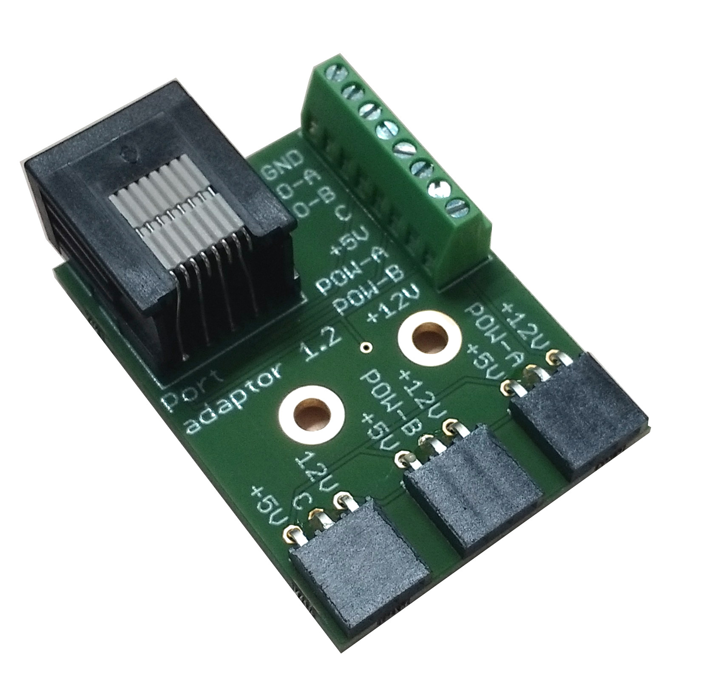

# Port adapter

The port adapter breaks out all the pins on a behaviour port to a screw terminal connector, and the driver line pins additionally to three header connectors each with +5V and +12V pins to connect loads such as houselights or solenoids.