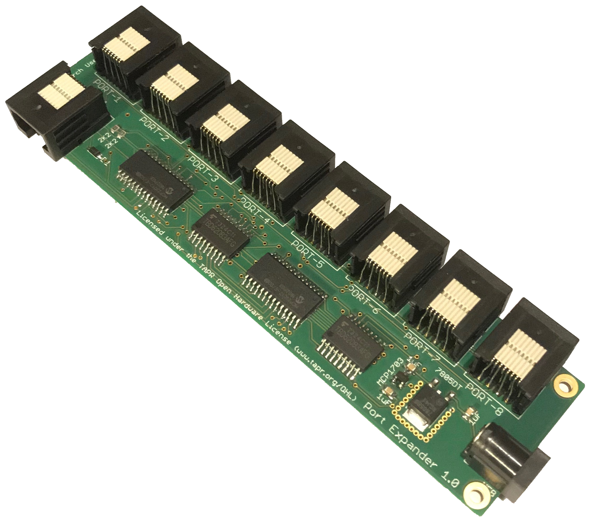

# Port Expander

The port expander board uses i2c serial to parallel IO expander ICs to run 8 behaviour ports from a single behaviour port on the breakout board.  

[Documentation](https://pycontrol.readthedocs.io/en/latest/user-guide/hardware/#port-expander)