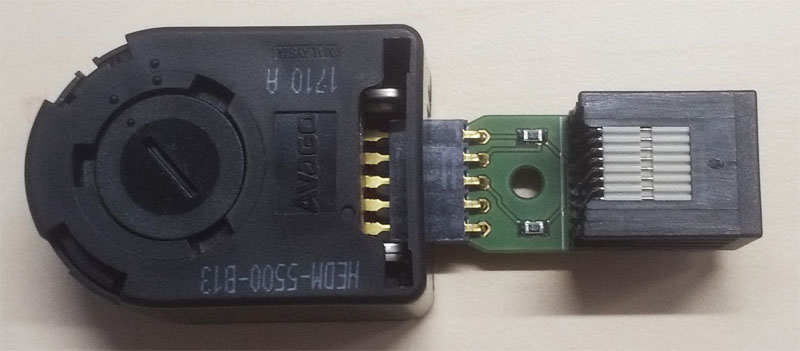

# Rotary encoder

Board for connecting an Avago HEDM or HEDS series rotary encoder to a pyControl behaviour port.

[Documentation](https://pycontrol.readthedocs.io/en/latest/user-guide/hardware/#rotary-encoder)

