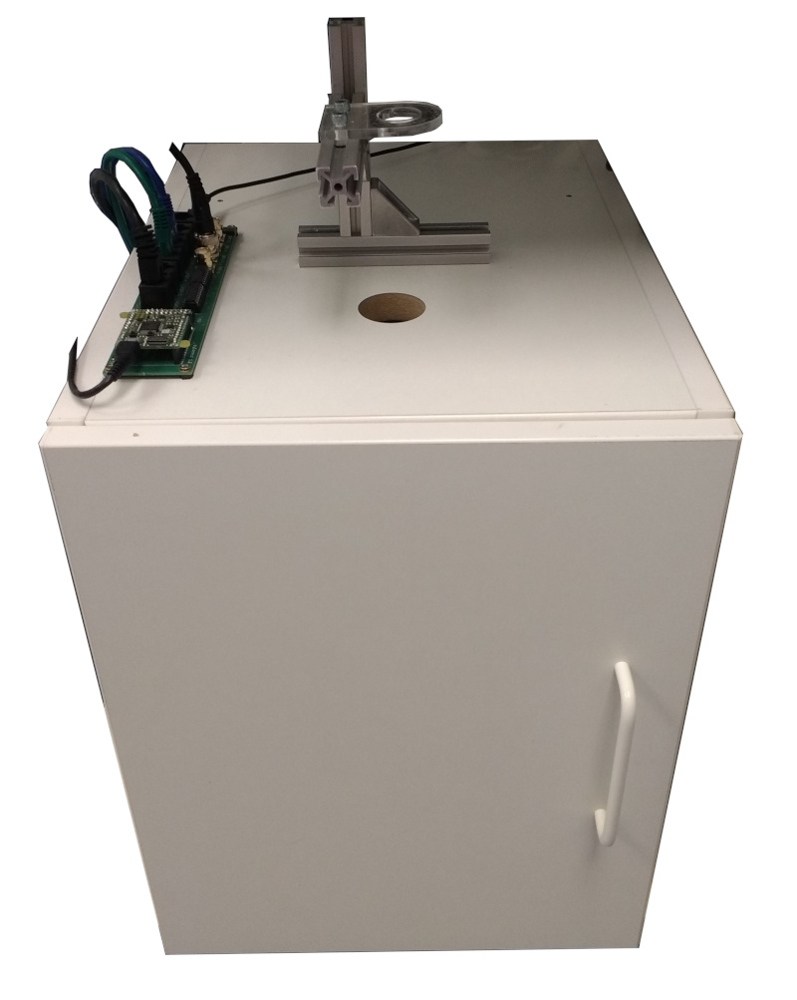
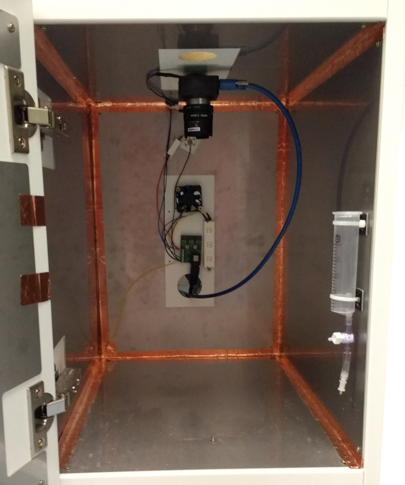

# Small sound attenuating chamber

| Exterior                                     | Interior                                     |
| -------------------------------------------- | -------------------------------------------- |
|  |  |

A sound attenuating chamber suitable for use with the [small behaviour box](https://github.com/ThomasAkam/pyControl_hardware/tree/master/Behaviour_box_small). 

## Assembly instructions.

1. **Cabinet.**  Get the cabinet detailed in *cabinet_design.pdf* assembled in 18mm melamine coated MDF.  There are lots of companies that make custom MDF cabinets/furniture, and any one should be able to make the cabinet given the information in the design file.  The design file is editable in Illustrator if you need to modify the design.
2. **Optional: Faraday shielding.** If you plan to use the cabinet for electrophysiology recordings it is recommended to line the inside with stainless steel panels which act as Faraday shielding to reduce electromagnetic noise.
   1. Get the panels laser cut in 1mm stainless steel.  The design files in the folder *stainless_steel_panels* are dxf files with scale 1 unit = 1mm.
   2. Attach the panels to the inside of the box using 12mm wood screws.
   3. Seal the joints between the panels using copper tape.  Connect the panel on the door to the adjacent side panel using copper tape.
   4. Once the setup is completed, don't forget to connect the Faraday shielding to the ground on your ephys system.  We normally do this by connecting the shielding to the ground on the port adapter PCB (see below) and then connecting the pyControl system to the ephys system via a BNC cable which connects the grounds on both systems and is also used to send sync pulses.
3. **Fan and house light.** 
   1. Mount *pyControl Port Adapter* PCB onto the inside of the back wall of sound attenuating chamber between the two holes, using 3mm spacers and 12mm wood screws.
   2. Mount the fan over the the upper hole in the back wall of the sound attenuating chamber using 16mm wood screws.  Connect the fan's positive and negative wires to the 12V and ground connections on the Port adapter PCB's screw terminal.
   3. Solder wires onto the white 12V LED module.  Mount the LED module onto the inside back wall of the sound attenuating chamber using 12mm wood screws.  Connect the positive wire  from the LED module to the 12V line on the port adapter and the negative wire to the `POW_A` line.  This allows the house light to be controlled using the `POW_A` output on the behaviour port.
4. **Optional: Camera and IR illumination.**   The Point Grey camera and lens combination in the BOM has a field of view which matches the size of the small behaviour box.  This camera gives excellent image quality and the ability to synchronise video with behaviour using the camera's GPIO pins (see the [synchronisation](https://pycontrol.readthedocs.io/en/latest/user-guide/synchronisation/) docs).  To get the best image quality with this camera it is recommended to use a high power IR LED to provide adequate illumination.  This also ensures the video brightness is minimally affected by task related lighting changes (e.g. the house-light).  For setups where high quality video is not essential, bird box / mini CCTV cameras are a cheaper option.
   1. Mount the Point Grey camera to the top of the sound attenuating chamber using the tripod adapter, mini ball head mount, and 1/4-20 UNC bolt.
   2. To allow sync pulses to be sent from pyControl to the camera, connect the ground (black) wire from the from the Point Grey GPIO cable to the ground line on the port adapter PCB, and connect the GPIO3 (green) wire from the GPIO cable to the `DIO_B` line on the port adapter PCB.  We typically use `DIO_B` on behaviour port 6 of pyControl breakout board 1.2 for sync pulse output.   This pin is shared with the BNC 2 connector on the breakout board, so you can send sync pulses to the camera via the port adapter board and to a physiology system via the BNC connector from the same pin.
   3. Connect the IR led module in series with the 12 Ohm resistor between the 12V and ground lines on the port adapter PCB.  Mount the IR LED module and 12 Ohm resistor high on the back wall of the sound attenuating chamber using the heatsink tape.  **!!! Safety !!!**  The IR LED module is very bright in the near infrared and could damage your eyes if you look directly at it from close range.
5. **Optional: Rotary joint mount.**  The rotary joint mount provides a convenient adjustable height mounting for a rotary joint above the hole in the sound attenuating chamber. 
   1. Slide two of the pre-assembly nuts into the slot on the top of the base rail.
   2. Mount the base rail onto the top of the sound attenuating chamber using 30mm wood screws and M5 washers.  
   3. Mount the vertical rail onto the base rail using a bracket, pre-assembly nuts and 10mm M5 bolts.
   4. Mount the horizontal rail onto the base rail using a bracket, pre-assembly nuts and 10mm M5 bolts.
   5. Mount your rotary joint onto the top horizontal rail using a laser cut acrylic panel, pre-assembly nuts and 10mm M5 bolts.  The file *Doric_FRJ_rotary_mount.pdf* is an example panel for mounting a Doric lenses FRJ rotary joint.  You will need to adapt this to mount for other types of rotary joint.