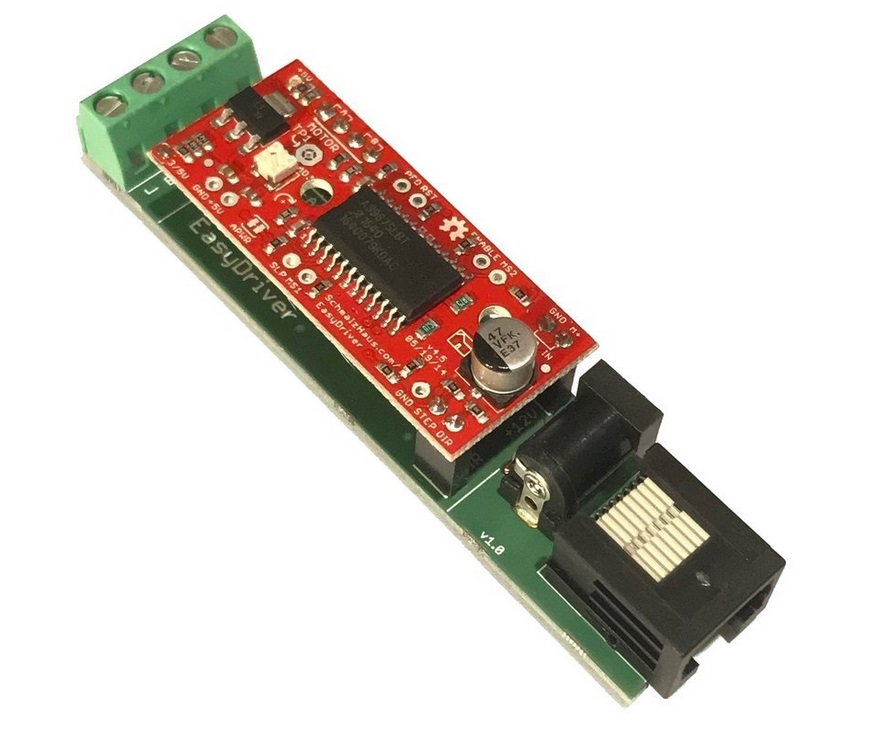

# Stepper motor driver

Board for connecting an [EasyDriver](http://www.schmalzhaus.com/EasyDriver/) stepper motor driver to a pyControl behaviour port.

[Documentation](https://pycontrol.readthedocs.io/en/latest/user-guide/hardware/#stepper-motor)

