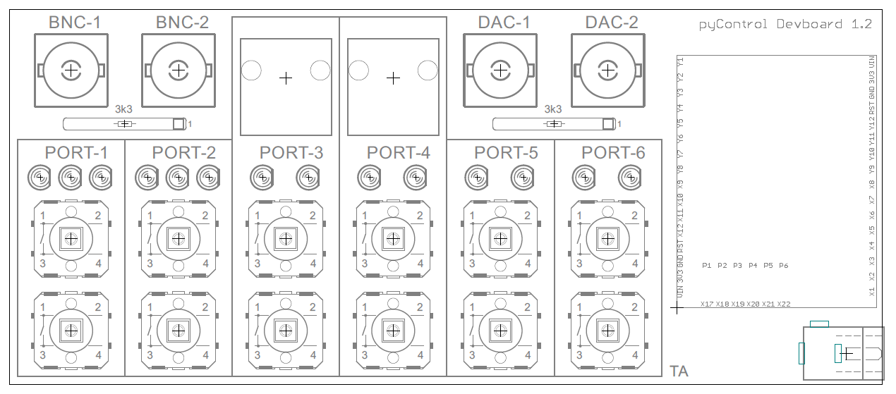

# Devboard 1.2

The devboard is used to emulate pyControl behavioural hardware while developing tasks.  It has the same pyboard microcontroller as the breakout board 1.2, but instead of the 6 behaviour ports on the breakout board it has pushbuttons to emulate the DIO lines and LEDs to emulate the POW lines on each port.  It additionally has RJ45 connectors for port 3 and 4 allowing pyControl devices such as audio boards to be connected, and has the same BNC connectors as the breakout board.